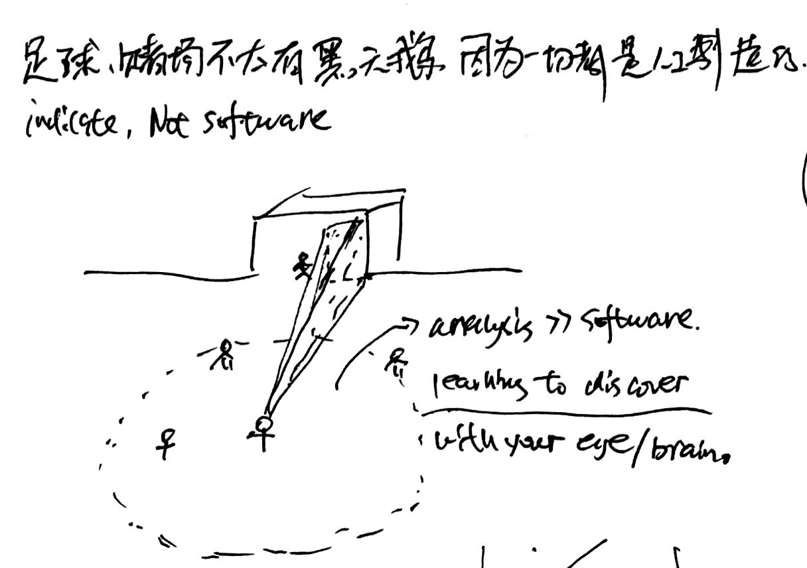
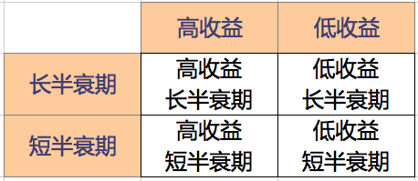
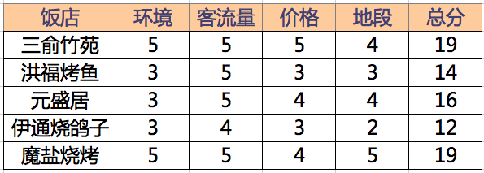
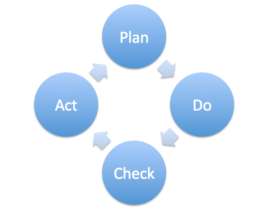

# 1. 思考

## 1.1. 致富之道

致富需要有钱，那么我们需要先考虑「怎样赚钱」，然后再思考「怎样赚很多钱从而致富」。关于赚钱，我的结论是：

- 赚钱需要交换，所以首先我们需要有能拿来交换的东西。也就是说，**首先要有值得交换的产品**；
- 值得交换的产品，必须是别人需要的东西。也就是说，我们需要**创作别人需要的东西**；
- 别人需要的东西，通常来说是可以给他们创造价值的东西，或者至少需要是他们以为可以给他们创造价值的东西；

那么结论就很明显，我们可以通过**创造一些别人需要，或者至少别人以为自己需要的东西来交换，从而赚到钱**。

在企业里面工作，就是因为可以通过企业的协作，创造产品；其他自由职业，诸如自媒体、创业老板等，也都是在创造着各种产品；还有一些，比如基金经理，是在通过提供别人以为可以给他们创造价值的服务来赚钱，他们的产品就是自己的专业技能。

那么，你的产品是什么？你为别人创造的价值是什么？

## 1.2. 成长才是最关键的事情

吴军在《见识》里面提到的干点私货赚外快的事情，自己之前也遇到过。当时还挺羡慕的，每天下班后加加班，几天下来好几千到手。但看了他的分析却觉得自己的境界毕竟还是太低了。其实，时间利用的好不好，关键要看自己在做这些事情的过程中，有没有学到新东西，自己有没有成长。如果没有成长，能推还是推掉的好，哪怕会损失点钱。毕竟，从起来看，没人能靠这些私货、加班加点的东西发家致富，但不断提升自己水平，积累到量以后却可能发生质变。

所以，上班的八小时时间里玩命工作，下班后争取不加班，而是回家学习新东西、新技能，甚至读个在职研究生，边际收益比那些差事要大多了。

### 1.2.1. 尽早离开不能让人继续成长的地方

很多人在考虑工作时，都会担心选择离开或改变会有风险，但他们却没考虑到不离开不改变的风险。其实职场中最大的风险就是呆在在一个无法让你继续成长或发展的环境，而市场中的其他人却在不断提升。

不久之后，你就会发现，自己的竞争力已大大减少。所以，哪怕这个地方暂时有很好的待遇、安逸且得心应手的生活，也不要贪恋。需要走时，应尽早。

### 1.2.2. 勤于反思及总结

事情办完以后，不要急急忙忙冲向下一个任务，而是要停下来思考一下，自己可以刚才这件事情里学到什么？有没有什么地方需要改进的？勤于反思，勤于总结，争取让每一件事都成为自己成长的契机，是自我提升的不二法门。

尤其对于一些需要多次重复的事务性工作，一旦完成，尽量总结成清单，甚至做成自动化脚本，可以为以后节约大量时间，而且可以把事情做得更好。

### 1.2.3. 寻找人生教练

《重新定义公司》和《重新定义团队》里面都提到了商业教练的事情。世界上最顶级的运动员依然需要教练，谷歌的CEO也需要商业教练。教练的好处，不在于他水平比你高，而是可以从旁观察，常能旁观者清。

所以我们的人生也需要教练。教练的意义，就是通过观察，指出自己那些地方需要改进。人生的伴侣朝夕相处，其实可以作为最佳教练。以后要注意和丫头多沟通，指出对方需要改进的地方，充当彼此的人生教练，实现共同进步。

## 1.3. 修炼品格

查理芒格说，想要得到一件东西，最好的办法就是让自己配得上它。那么就修养自己品格而言，有什么好的品格是我们注重的呢？

- 坚持；
- 自控；
- 好奇心；
- 自省；
- 自信；
- 热心；
- 认真；
- 专注；
- 公平；
- 诚实；
- 热爱学习；
- 谦逊；
- 尽责；
- 感恩；
- 积极主动；
- 豁达；
- 自信；

长期思考，不断补充。

### 1.3.1. 回应之前先停一下

遇事的本能反应很难是最佳反应。面对任何事情，做出反应之前不妨给自己个缓冲，先暂停一下，思考以后再给反馈，会比直接本能反应好很多。无非三五秒，却是另一个世界。

### 1.3.2. 避免人云亦云

除非自己的确明白和理解一个话题，否则不要轻易发表意见，避免人云亦云。一个很好的判断就是，如果一个话题自己不能举出更多例子，其实等于没有理解。这时候应该把重点放在理解话题本身上，而不是拿已知案例说事儿。

比如说，你真的理解「幸存者偏差」和「黑天鹅事件」么？

## 1.4. 项目思维

任何复杂的事情，都可以当做一个项目来实行，这就是项目管理的意义。其实项目管理应该是每个人都学习的基本技能，大一时候应该列为必修课。

具体可参考edx.org上的课程

> [Introduction to Project Management](https://courses.edx.org/courses/course-v1:AdelaideX+Project101x+1T2017/course/)

### 1.4.1. 有输出成果

无论做什么，应该想办法做出最终的成果。所谓成果，可以是

- 公认的注册考试类；
- 学历类认证；
- 可对外发布的成果；
- ……

不管怎样，都需要有个结果性的东西。光说自己强没什么用，口头谁都能白活，而且在乌比冈湖效应下，很可能所谓的强不过是自己的意淫。最终拿出真凭实据的成果，才最牛逼。

## 1.5. 克服思维偏误

### 1.5.1. 欲得性偏见

德摩斯梯尼曾说

> 一个人想要什么，就会相信什么。

这是一种很可怕的偏见。相信一个东西，理由应该是诸如「他是对的」或者「他是符合逻辑的」或者「大概率是可能发生的」之类。而我们大多数人，更容易因为希望它是真的，就相信它是真的，同时回避或者抗拒任何对它不利的证据，结果盲目一条路走到黑。

诸葛亮的出师表里面谆谆告诫刘禅

> 诚宜开张圣听，以光先帝遗德，恢弘志士之气。

可见诸葛亮对这个事情也很谨慎。但遗憾的是，他自己都没有做到。明明天下三分已定，不宜再起干戈，他却为了实现自己的政治抱负，六出祁山，最终命丧五丈原，就是一心相信自己想要的东西。可悲可叹。

### 1.5.2. 没有证据表明vs证据表明没有

《黑天鹅》里面火鸡的例子非常好。火鸡连续观察了1000天，每天都会有食物而没有危险，这便是「没有证据表明会有危险」。但这与「证据表明没有危险」是完全不同的，没有证据表明得不出对未来有价值的推断，第1001天可能就是它进厨房的那天。

这种思考方式对我们有什么意义呢？最大的意义就是，不要盲目自信。过去不代表未来，过去的好可能只是运气好，或者时机未到之类。永远心存警惕。

### 1.5.3. 不接受随机性

世界很多事情都是随机的，或者说没有任何理由可以解释的。我们的大脑倾向于给事情提供一个原因，因果论述会减少大脑认知消耗。但很多时候这种倾向是错误的，事情就是发生了，没有理由，没有原因，纯随机。

这就要求我们真实的面对世界。在没有确切证据或答案之前，保持对事物不可知的状态。难，但值得努力。匆忙下的结论往往是不可靠的，甚至是错误的。

### 1.5.4. 确信偏误

一个人对一件事情的确信程度，并不能成为一件事情是真或假的依据。很可能他不过是深刻的错误罢了。想想YY在车位投资上的确信程度，就可以知道确信的错误是多么的可怕。

证据，依据，制度，制约，这才是可以相信的东西。而不是对方对某件事情个人的态度和观点。

### 1.5.5. 迷信权威偏误

自己一向有迷信权威的倾向，总觉得权威人士都很厉害。现在渐渐觉得，所谓权威其实也不值得怎么迷信

- 权威可能是其领域内的权威，在领域外也可能很无知；
- 权威也会犯错，所以考察权威的时候应该关注其提供的理由和证据，而不是他的观点；
- 权威有自己的立场和利益，对他好不一定对你好；

所以以后要逐渐注意克服权威迷信，更多的相信数据、制度、约束等，而不是相信权威本人。

### 1.5.6. 被沉没成本牵制偏误

对于已经没有办法改变的沉没成本，要有壮士断腕的勇气和魄力，而不要因为已经付出很多，结果在一条错误的路上越走越远。

记住，当下的决定，应该是现在的状态如何，未来的发展如何，而不是过去如何。

比如进入一家公司，如果发现这家公司没有自己想象的好，甚至很烂，最好的办法是尽早离开，换个工作，而不是因为已经为得到这份工作付出了很多，就在一家烂公司待下去，幻想它可能变好。否则既蹉跎了岁月，又浪费了自己。

## 1.6. 抓住关键参数

我们需要锻炼一个很重要的能力，就是抓住关键参数的能力。每件事情都有很多参数、很多考量，但不是所有参数都同等重要。把关键参数抓住了，事情基本就解决一半了。

比如玩互联网，很多人会说什么「内容为王」、「社区为王」等概念。而实际上，互联网从根本上就是在玩流量，应该是流量为王。有了流量，什么就都有了。

再比如买房子，有人会考虑户型、朝向、楼层等多种因素。不是说这些因素不重要，但真正重要的，其实是位置。好位置才是一个房子最重要的属性，否则其他再好都没什么价值。

具体做法，可以是把能想到的参数都列出来，然后找数据、找支撑，确定到底什么参数是关键参数。Coursera在线课程[Effective Problem-Solving and Decision-Making](https://www.coursera.org/learn/problem-solving/home/welcome)里面餐馆的例子就是典型案例。

## 1.7. 以正合，以奇胜

那么对于芸芸众生，致富之路到底是什么？我也在寻找。近几天读孙子兵法，讲作战要「以正合，以奇胜」，颇有认同。正即为主业，靠以安身立命；奇为副业，诸如投资、写作。想致胜，应先攻正业，立于不败之地，然后再出奇，谋求更高的收益。所以对于我们普通人，可能最好的办法，是先走正道，同时找方向。

## 1.8. 慢慢赚钱的心态

屌丝逆袭，弯道超车，有太多的人想一下子咸鱼翻身了。但实际上，这些都不是世间常态。更多的情况是，富人有更多的学习时间，更好的资源，更强大的人脉，而且抗风险能力也更强，所以最后更成功的也是他们。屌丝上蹿下跳，结果还是在原地瞎折腾。

这事儿吧，我觉得首先得把心态摆正了。要知道，这世上逆袭是小概率事件。对于每一个平凡的人来说，更大概率的成功路径，其实应该是认真工作、好好学习，在现有阶层一点一点往上爬。这样看起来慢，但时间久了，复利的效果就出来了，日子总会一天好过一天。

总想逆袭，总想意外的抓住一些机会，更可能因为自己没那个储备，反而抓了一地鸡毛。手头有10w的时候，别想着怎么一下子把它变成100w，不如参考一下社会平均收益率，琢磨能不能比这个稍微高一点。比如A股的平均收益率大概是年化7%，那么自己最后能拿到个8%，就是不错的成绩了。而别总想着拿到80%。

这怎么能暴富？当然不能。前面说了，暴富可遇不可求，天上掉馅饼的事情，本就没法计划。接受现实世界真正的规律，一步一步的往前走，才是一个成熟的人的标识。你看到了别人的光鲜，却没看到他为了那一刻流了多少汗、准备了多少年。只想吃肉，不想养猪，老天凭啥想着你？

孙子兵法，主要讲的也是这个道理。世人皆以为孙子兵法讲究以弱胜强、兵不厌诈，其实人家讲究的是以强胜弱，先胜后战。在开篇的「计篇」里面就讲

> 故经之以五事，校之以计，而索其情。一曰道，二曰天，三曰地，四曰将，五曰法。

只有庙算能胜，方可出击。讲白了，就是要讲究基本面。基本面到了，仗就容易打赢；基本面不到，就回去慢慢修炼。对于我们个人，水平到了，就可以创业、投资赚大钱；水平不到，最好的办法是先回去修炼内功，等水平足够高了再来办大事儿。而不是揣着一颗悸动的心，先干了再说。那样十有八九会死的很难看。

这个「慢」的心态，需要修炼。不急不躁，是种境界。不过光这么说没啥用，还是得回到方法论上来。有一个很好的办法就是，享受在路上的感觉。人生的意义，并不仅仅是实现了自己的目标，为自己目标努力的过程，以及一天比一天有进步的状态，都是生活的意义。有了这种态度，自然就会慢一些下来。

只要每天有进步就可以，积跬步以致千里。

所以说，赚钱，首先要摆正心态。没有这种淡然的心态，多得是赌徒。而赌徒，十赌十输。

## 1.9. 十倍赋能

凡事多往大想，是在看[《重新定义公司》](https://book.douban.com/subject/26582822/)里提到的谷歌思考问题的方法，觉得可以借鉴到我们个人生活里。做什么都有成本，其中尤其以机会成本为大。所以但凡做事都要事先想想，这件事情到底值不值得做。两个问题可以用来理清思路

1. 这件事放在10年的长期上考虑，值得做吗？
2. 这件事能否增强10倍效果？

如果答案是否定的，那不如不做。真正有价值的事情，值得以10倍来衡量。

### 1.9.1. 减少在切换工具上浪费浪费时间

比如各种工具软件层出不穷，但如果手头现有工具用的挺好、新工具不能比它强10倍以上，就不要轻易切换。为了一点优势换来换去，太浪费时间。

现在我们的问题不是选择少，而是选择太多。所以要克制自己频繁选择。

### 1.9.2. 如何让收入增加十倍？

想要增加收入，加班是最直接的办法。通过加班，一来可以增加直接收入，二来可以获得晋升的机会，实现薪酬跳跃。但如果升职无望，或者只是做一些简单的事情获取更多收入，就不是上选。因为这样最多能多收获1.1~1.2倍收入，无法达到十倍收益。

那什么办法能实现十倍收入呢？比如进一步学习新的知识、新的技能、甚至新的专业，再通过把它们凑成一个矩阵。但不管怎么说，都比靠多花时间更有效。

十倍赋能和慢慢赚钱的思路是不是冲突？不冲突。十倍赋能是让凡事儿往大想，通过扩大思维的方法提升收入；慢慢赚钱指的是尊重经济规律、修炼基本功，最后实现十倍收益。可以说十倍收益是目标，慢慢赚钱是方法，一个关注程度，一个关注速度，两者相辅相成，并无矛盾。

## 1.10. 关注十年为周期的收益

这两天看《曾国藩传》，常常感慨他的定力。曾国藩有一个特点，就是抓大放小，知道到底什么重要，集中火力搞定真正重要的事情。

比如攻打太平天国时围攻安庆，恰值第二次鸦片战争清廷节节败退，咸丰皇帝仓皇出逃承德，发文命曾国藩火速派鲍超带三千人赴京勤王。虽然曾国藩以忠诚自命，这次却硬是抗命未尊。因为如果调兵北上，安庆势必撤围，功亏一篑。同时第二次鸦片战争形势明朗，英法联军攻下北京是早晚的事，未来只有议和一途。派几千人北上，根本改变不了这个大局。所以虽是皇帝圣旨亲传，曾国藩也不为所动。

这就是大智慧，识大局，知道什么重要。那么对于赚钱来说，什么最重要？我觉得当属**长期收益**。长期利润指的是至少从3~5年的周期来看，大概率盈利。有人愿意做短线，捕捉各种机会，其实这些机会大多短线，不可持续，即使赚到钱，也需要尽早退出好锁定收益，所以不符合长期收益。

为什么说长期比短期重要？一个原因是短期风险较大。就算再判断正确，一次亏损就可能把之前的利润全部退回，而短期涨跌谁也看不准；二是短期利润不可持续，就算锁定收益了，也需要为回笼的资金找下一个机会，这个等待期就是机会成本。好的投资机会不多，所以等待期就会很长，导致之前短期利润率再高，最后也被拉平，得不偿失。

所以，不妨也效仿曾国藩，结硬寨打呆仗，哪怕收益率不够高，也要能长期有收益且低风险，耐心的和时间做朋友赢收益。

## 1.11. 复利效应

复利效应可以考虑做十倍赋能的一个工具。复利效应在长期积累下会产生十倍赋能。那么有哪些事情具有复利效应呢？

### 1.11.1. 梳理原则

当下正在做的事情。

### 1.11.2. 指数基金

反复投入，长期盈利。

### 1.11.3. OKB/NULS

需要进一步思考，因为本质上需要他们是价值币种才有复利效应。

### 1.11.4. Python

等运筹学学习之后琢磨一下可以如何提高Python。

### 1.11.5. 阅读

无读书，不成长。不过读书也分高下，可参考阳志平先生的分类，将其分为坏书、可用的书、力作、杰作与神作五类。

- 如何提高自己的阅读水平？

### 1.11.6. 维护个人信誉

个人信誉需要积累。长年累月的言必行行必果，会积累出良好的个人信誉，在关键时候往往会有奇效。

维护信誉需要注意的有

- 不胡乱推荐。尤其在移动互联网时代，随便看到什么消息就转发，只会降低自己的信誉。要知道，给人推荐东西的时候，其实是在拿自己的信誉背书产品的质量；
- 言出必行。不轻易承诺，一旦承诺就要尽全力做到。承诺却不做到，一次就足够把过去多年积累的信誉毁掉；一旦事情的难度超过自己预期、当初承诺的事情没能做到，要尽早尽快通知对方，避免误事；
- 形成闭环。遇事一定要有明确结论，甚至在当前没有明确结论的时候，也要形成闭环，给别人一个清楚的预期；

### 1.11.7. 营造良好的个人形象

良好的个人形象会在与人交往中得到额外加持。哪些事情是我们需要注意的呢？

- 及时回复。无论是邮件还是短信，别人有消息过来，尽早给个回复，哪怕只是告诉别人自己收到了，稍晚点答复；
- 礼貌。想要独来独往的性格没有问题，但遇人礼貌是修养；

### 1.11.8. 写灵感笔记

记笔记分为工整的正式笔记，和随意的灵感笔记。正式笔记常有专门格式，根据要求进行即可。灵感笔记最好用纸笔，涂写随意，激发创意。

每天抽点时间，随便在笔记本上写写画画，其实是激发灵感、进入发散模式的极佳方式。而且这种行为适应性极强，连等公交车等碎片时间都可以充分利用起来。

## 1.12. 设定正确的目标是成功的前提条件

凡事在目标确定以后就很简单了，无非是动手执行，真正困难的是设定目标本身。一不小心目标设置错误，可能事倍功半，甚至导致失败。

比如跑步时，目标可以是每个月至少跑10次，也可以是一共月至少跑60公里。这也是众多跑者最常见的目标，但其实它们都不是好目标。跑步的目的应该是健康，健康的指标有很多，比如耐力增加，体质改善。以次数为目标容易陷入「每天跑5公里就行了」的心态，结果跑来跑去没有提高；以距离为目标可能这次多下次少，月底一周追个40公里，直接把身体搞废。

更好的目标，应该是对自己想要达成的目的有帮助的目标。比如单次距离的增加可以作为耐力增强的指标，那么可以给自己设定一个「每月10次，每次至少比上次多跑100米~500米」的目标。一个月后，单次跑量就可以较上个月提升约2公里。如果目标达成，也标志着体能自然得到了增强。

再比如读书，最常见的目标是设定月阅读量，比如每个月三本。而实际上，读书的目的是要吸收和消化书里的知识，并把它们融入到自己的日常生活中，进而改善生活。所以好书需要慢慢读，反复读，反复思考，并为之制定行动策略，以及在行动中反思及改善。要求每个月至少三本书，更可能的情况是匆匆忙忙读完一本，就赶着开始读下一步。没有思考，没有反思，更没有行动。读来读去，就像猴子捞月，直到最后也不过手里一捧湖水罢了。

那么这个思路和赚钱有什么直接关系么？这是个值得思考的问题。

## 1.13. 宏观形势及政治走向不可预测

宏观经济形式及政治走向是不可预测的。巴菲特说从来不关心美联储的货币政策之类，是非常明智的选择。按照塔勒布的说法，这些事情都是由黑天鹅驱动的，而黑天鹅本质就是不可预测的。

所以我们可以根据舆论的情绪感知牛熊，但切不可预测宏观走势、转折点之类。一点点定投，熊市加仓，牛市卖出，吃个鱼身子就够了，尤其在股市。

## 1.14. 提升选择能力

网上流传一个说法，人一辈子关键选择有7次，选好了飞黄腾达不可限量，选不好一生落魄居无定所。

这个说法其实有个很严重的问题，就是容易让人觉得，一辈子做好了选择，就可以过得既轻松又惬意。其实生活不是这样的。

一方面，选择本身就是个技术活。选择可能的确大于努力，问题是不努力的话又怎么会有能力做出正确的选择。任何的选择背后，都有无数过往的积累。不读书、不学习，见识窄，结果可能是让选也不知道应该怎么选。

比如现在都知道，十年前应该买房。但在当时，没有关于房地产对经济驱动的认识，就不一定能做出买房的选择。比如，你觉得现在是不是买房的好时机？

再比如，现在都知道大城市的集聚效应，人应该往东南沿海发达地区去。但十几年前，在国家开发大西北、振兴东北老工业区等口号的影响下，如果没有城市化的认识，很可能就会稀里糊涂的跑到东北或西北。

所以说，选择的确很关键，但学会选择更关键。这必然牵扯到大量阅读、广泛涉猎有关政治、经济、历史等方面的知识。

难怪说全人教育。光学会数理化，是没有什么大用的。

## 1.15. 从选择正确的事到让正确的事发生

选对谁都想，但是选择时既然需要面对未知，就自然难以达到理想状态。所以事后回想，我们都可能犯错。与其纠结于选择，我们还有一个方案，就是让正确的事情发生。

比如选择了经商，有成功的商人，也是破产的商人。选择了做自媒体，有百万粉丝的大号，也有门庭冷落的失败者。在当下已经选出的道路里，用正确的方法努力做事，让事情往好的方向转变，对我们需要面对的每一天，才是更正确的方式与态度。

所以996怎么了？想要更好的生活，这点付出还不应该是基础中的基础。

## 1.16. 关注真正重要的事情

技术流的人物容易陷入技术细节及技巧性的东西，而忽视真正重要的东西。如果我们相信「选择>努力」，就应该明白，那些起决定性作用的选择，都是需要从大局观出发思考，而不可能是由技术细节决定的。

孙子兵法谈到战争时，讲究「道、天、地、将、法」。前面三个是基本面，和技巧没什么关系；后面的将和法关系打仗，有技巧性的东西，但绝不是这些技巧性的东西决定胜负，而应该是平日训练、后勤保障等这些硬功夫更起决定性作用。

所以，时常应该关注一下生活中，真正重要的东西。比如

- 时代的风口是什么？
- 业界会如何演化？
- 我在时代大势里面能做什么？
- ……

这些问题，比把某个技术细节弄得更清楚一些，要关键的多。

## 1.17. 聚焦--懂得取舍

对应于大局观，就是在生活中要懂得取舍。什么东西重要，什么东西不重要；什么东西是当下最重要的事情，什么东西是现在可以放一放的。想清楚了这些问题，就要集中火力在最关键的事情上，把其他所有需要丢弃的都抛开。

生活需要断舍离。

比如当时报考读研，雅思就是最重要的事情，所以玩命学英语，把其他东西都放下。现在Offer已经拿到，英语虽然也重要，但已经不是罪重要的事情了，就可以一边继续学英语，一边补新专业需要的基础课，诸如线性代数之类。这就是在不同阶段要有不同的焦点。

再比如设计院当年的一个很大问题，就是不懂取舍。市场恶化的时候，什么活都接，导致一些根本没有利润甚至可能导致亏损的项目也要承接，而且浪费了大量人力资源。一个投资1000万的项目和投资100亿的项目，放在同样重要的地位，导致生产部门疲于奔命，就是不懂取舍。

### 1.17.1. 克制--成功的必备品质

克制还是一切成功的必备条件。打仗需要等待时机，时机不到的时候要克制自己想要一战的冲动；锻炼身体需要休息，要克制自己总想活动的冲动；充分利用时间更是需要理性，克制自己在没有价值的玩乐上浪费时间。可以说，没有克制，就没有成功的人生。

考虑到时间的机会成本，克制就更显重要了。我们可以把需要克制的东西列出来，时常检查更新，警示自己。

### 1.17.2. 二八原则

凡事分出什么重要，什么关键，然后集中火力把这些事情搞定，可以极大的简化生活中的各种问题。

虽然二八这个数字肯定不精确，但道理没有问题。绝大多数问题，必然是由没有处理好的很多重要事情引起。比如健康，比如家庭。

关键问题在于，怎样区分到底什么事情是这重要的百分之二十，以及这些问题应该怎样解决。比如我现在知道我的很多问题都是因为钱少，然后呢？

但提出关键问题，本身就是成功的开始。

### 1.17.3. 专注于自己的核心竞争力

华杉讲的几个企业案例挺有启发。华为不进房地产，阿里巴巴不做游戏，一点一点打磨自己的核心竞争力。等厚积薄发的时候，别人已经没有办法与它抗衡了。怎样能有真正的核心竞争力？用时间一点点磨，磨得别人想和你竞争需要坐时光机回到十年前，这就等于拥有了自己的护城河，打磨出了自己的核心竞争力。

这里关键有两点

1. 选择正确。坚守最怕的是坚守了错误的东西，到最后都成了沉默成本。比如当年有一个网站，用户填写农历后可以在设定时间发短信提醒，算是填补了国内用户用农历的麻烦。但移动互联网一来，几乎没人用短信了，再打磨也没有什么竞争力了。所以首先需要选对大势；
2. 专注。一旦选定目标，就要一直专注的做下去，不要轻易被其他潮流吸引。这需要放弃很多东西，非大智慧大魄力不能为。得到因为搞投资来钱太容易，所以不搞投资，专心做知识服务，就是专注的大智慧，值得学习；

### 1.17.4. 律师法则

生活中难免有各种奇怪的事情，会让我们烦心。比如无良商家缺斤少两，出租车司机绕路之类。遇到这种事情，最好的办法不是自己去PK，因为很可能别人有的是时间；不如干脆找个律师，把专业的事情交给专业的人去做，往往能收到更好的效果。

有人说律师费可是很贵的，常常是维权成本比收益都高。其实这也可以考虑成一条法则，如果损失连律师费都不值，那也不值得我们花费太多时间和精力在上面。总为这些小事费心，就没有精力在真正重要的事情上了，那才是最大的损失。

### 1.17.5. 远离任何不值得交往的人

不值得交往的人有各种特点，一旦识别出来，尽早远离，千万不要在其身上浪费时间。他们就像泥潭，会让你也深陷进去。这样的人的特点有

- 负能量太重。什么事情都是坏的，到处抱怨；
- 素质低下。虽然人的素质可能有成长环境的原因，但抱歉我没有兴趣对你的成长环境负责；
- 阴谋论者。阴谋论者心理大多阴暗，待人看事无不如此。虽然我没有证据证明阴谋论者是错的，但抱歉我们三观不合；
- 迷恋权势者。世界上最不可靠的就是权势，所以迷恋权势的人注定是反复无常的小人；

心里始终要有根弦，不是所有人的值得交往，不是所有观点都值得欣赏，不是所有选择都值得歌颂。去高价值的地方，远离泥潭。

## 1.18. 正确比成功更重要

当初稀里糊涂买币，早期也颇赚了一点钱，于是得出结论，买到就是赚到。结果熊市一来，亏得要死。

做任意一件事，都会强化我们的思维和行动模式。成功可能是偶然，而万一用错误的方法成功了，就可能得出错误的结论，结果继续用错误的方法做事，下次很可能就没这么走运了。所以正确是比成功还要重要的事情。

凡事无论成败，都要多思考一下「正确与否」，而不要把焦点放在「成功与否」上。多做正确的事情，积累多了，成功就是水到渠成；否则盲人瞎马，早晚完蛋。

## 1.19. 用概率的思维思考生活

《黑天鹅》里面给出两种世界模型，一种是平均斯坦，一种是极端斯坦。我们的大脑更容易理解平均斯坦，而现实生活中很多事情都属于极端斯坦。思考世界及生活的时候，应该注意自己考虑的问题是属于哪个斯坦里的

- 身高、体重，平均斯坦；
- 饭量、腰围，平均斯坦；
- 财富、知识，极端斯坦；
- 声望、影响力，极端斯坦；

尤其需要注意的是，极端斯坦里面有些事情，一旦发生会极具破坏力，也即所谓黑天鹅事件。考虑任何问题都需要注意这类黑天鹅事件，若有发生的可能，无论多小，都要尽可能回避。

通过用概率的方式思考，我们可以得出以下推论

### 1.19.1. 把自己暴露在更可能发生好事的环境里

去年搬家到佛山后，就时常去香港、澳门、广州、深圳这些地方溜达。看得多了，感觉思路就比在长春的时候开阔了一些。最近正在筹划的一些事情，也是来这边以后才了解到的。

所以说，一个好的、开放的、更具活力的环境，对人的塑造是巨大的。之前在东北，想听什么讲座也没地方，大家聊的话题，无非是吃喝玩乐。一方面是城市落后没有什么商业机会，另一方面人的思维固化呆板。而在更发达的地方，不仅机会更多，强人也更多。强者如云的环境会逼着你不断提升自己。每次去深圳都有这种感觉，这是一座让人睡觉都会进步的城市。

来到佛山是前进的第一步，但绝不应该是最后一步。我们要不断的去更好的环境里面，发现一个更好的自己。

### 1.19.2. 接触高质量人群等于给自己创造好运

高质量人群的圈子，发生好事的概率会远大于低质量人群的圈子。想创造好运，就要尽量多的让自己与他们发生接触。

所以，是留佛山还是去香港，根本不应该是个问题。

## 1.20. 用大力胜巧的方法构建自己的核心竞争力

我们喜欢凡事都讲究方法策略。这事本来没毛病，事半功倍谁都想。但问题是，这些技巧大多只能锦上添花，却没法雪中送炭。真正起决定性作用的，往往不是这些技巧层面的东西，而是实打实的硬功夫。

比如学英语肯定有好的方法。网上到处都是讨论到底怎样正确学习英语的文章。但真正的情况是，决定英语水平的，是背了多少单词、句子甚至文章，这些东西，都是硬功夫，只能用最笨的办法，花时间一点点啃下来。词根词缀之类花哨的方法不是没用，但它们只能在你花了足够多时间的前提下，让你记得更容易一点，却没有办法让你不花时间精力就搞定词汇。

舞蹈，打球，象棋，写作……每一件事情想要做好，都是需要大量时间的投入。任何花哨的方法、策略、技巧、感悟，在这种粗笨的方法面前，都不值一提。

所以，琢磨投资，也要从这些硬功夫上下辛苦。投资股票，就找到市面上评价最高的十本关于股票的书，一本一本开始啃；投资房产，就找中介开始看房，先看够200套。到时候自然手中无剑却心中有剑。

蔡文胜说过的研究项目的方法，和这个也有类似之处。做域名时，就把全世界的域名信息做了一个数据库，跟踪每一个可能过期的域名，并且查询域名的价值。做个人网站，就把中国前1000名流量的网站全部查询，了解谁做的、如何做的、为什么流量大。进入微博，就把微博前100名博主每一个微博都浏览了，去发现为什么他的微博受欢迎，为什么他的粉丝多。这是硬功夫，也是真正的护城河。

世间是有天才，但天才这种事情，绝大多数时候和我们是没有关系的。所以平凡如你我，想凭借天分吃饭的可能性微乎其微，每一个个体的可替代性都太强了。那么通过结硬寨打呆仗的方法，一点点构建自己的核心竞争力，就成了最佳的选择。这也是古语说的「故不积跬步，无以至千里；不积小流，无以成江海。骐骥一跃，不能十步；驽马十驾，功在不舍。锲而舍之，朽木不折；锲而不舍，金石可镂」的真正含义。

等真的积累够了，别人就很难替代了。丝毫没有积累，还整天想着如何才能有不可替代的竞争力，无异于痴人说梦。

接受大力胜巧，是开始接受现实的第一步。

## 1.21. 积极主动

《重新定义团队》里面讲谷歌招聘的时候讲过这样一件事，就是他们从来不去招聘网站刊登广告，因为他们认为，动机强烈的求职者会主动到谷歌网站申请工作，只有动机相对较弱的求职者才会依赖于招聘网站。从这里可以看出，凡事主动一些往往会有意想不到的收获。

再比如以前和同事一起出去活动，有些同事自己没有车，又不主动联系有车的同事，最后就可能别人都走了，把他一个人丢那里了。自己的事情，必须自己上心。职场中，生活中，甚至恋爱中，婚姻中，无不应如此。

### 1.21.1. 主动选择

有一段话说的挺好

> 大部分情况是，穷人吃不了奋斗的苦，富人吃不了生活的苦。  
> 比如富人可以为了一个渺茫的机会四处打听消息，硬着头皮学习，起早贪黑的准备，穷人吃不了这个苦。  
> 穷人可以在冬天冷风里等公交，下车再提着大行李走很远的路，富人吃不了这个苦。

当时觉得这段话说的挺好，把穷人富人之间一个微妙的差异点说的非常清楚。今天又琢磨了一下，感觉好像也不是这么回事儿。穷人富人的差异不在于能吃什么类型的苦，而在于是主动选择去吃苦，还是无奈之下被动接受不得不吃苦。

富人打听消息、学习、起早贪黑的准备，是自己主动选择的；而如果有个很好的商机在一个偏远地区，只能在冬天冷风里坐公交过去，下车还需要提着大行李走很远的路，他也完全能吃得下这个苦，而且也会很乐意去遭这个罪。就像欧成效说的，一堆千万富翁为了一个合适楼盘的名额，会就着冷风吃着盒饭打地铺排队。谁敢说富人就吃不了这些苦。

而穷人，能不吃苦的时候就会选择不吃苦。硬着头皮学习太辛苦，起早贪黑准备辛苦，所以不去吃这个苦；而如果可能，他们也会很乐意不坐公交、不拎行李，离生活的苦也远远的。只是资金有限，没有选择，不得不如此而已。

主动选择，是生活极重要的一个点。一切都是随波逐流，或者任人安排，水平再高，生活也好不到哪儿去。眼界范围里的，无论是商界精英还是企业高管，无不是通过各种主动选择，甚至放弃很多利益，最后才成功突围的。甚至可以说，没有主动选择，就没有真正的生活。

因为不过是被动的接受生活打过来的巴掌罢了。

那么时机到了就可以主动选择抓住机会，时机没到怎么办？很简单，继续积累。主动选择不是随机做布朗运动，机会成本是最大的成本，乱动会耗光好资源。所以时机不到的时候，等待和积累才是最佳策略。

要能等，要会等。要耐得住寂寞，要知得了天命。这方面，司马懿是高手中的高手，堪称三国第一人。

### 1.21.2. 主动学习

### 1.21.3. 主动交往

## 1.22. 自己承担责任

生活中少不了有人会给我们提意见或建议。这些意见或建议，无论善意恶意，都需要注意，我们自己才是最后那个承担所有后果的人，所以要自己把相关责任也承担起来。别人有提意见或建议的自由，但最终选择权却是在我们自己的手里。自己可以选择听，也可以选择不听，而无论听与不听，在做决定的一刹那，事情就和别人没有关系了。获利是自己的事，万一发生损失也是需要自己承担，而不能也不应责怪那个给你建议的人。

有这样一种心态，做决定的时候就会慎重很多。尤其在做重大决策的时候，更是要把最终责任人这个事情落实清楚了。无论别人怎么拍着胸脯承诺或保证都没用，凡事仔细，前思后想，最后做自己的决定。有人会听别人的建议买入某个投资品，或者选择某个职业，最后发生亏损或遭遇困境的时候又责怪别人当初给的错误意见，其实就是在把本该自己承担的责任推卸给别人，还是没有长大。

成年人的世界，一切都需要自己扛起来。

## 1.23. 起点尽可能高

刚工作的时候，被老同志谆谆告诫，年轻人不要把自己看的太高，要把基础打扎实了，从基层做起。

当时还真信了。因为当时的社会思潮就是这样，说什么大学生好高骛远眼高手低之类，想着要在工作中把自己身上这股子书生气洗涤干净。现在回头来看，简直蠢得要死；而那些老同志，也可恶的要死。怕多是因为自己没本事怕被替代，就先把年轻人压到尘土里再说。

可能的情况下，起点一定要高，尽可能的高，高到自己在提升不了、甚至做起来吃力为止。一来取法于上，仅得为中，取法于中，故为其下。给自己的定位高了，能做到最好，做不到至少也能做个不错；而一开始定位就很低的话，是绝壁做不到什么好的程度的。

二来起点这个东西，很可能决定你的终点。起步在下级企业，除非做的非常杰出，否则很难提升到上级企业；而起点在上级企业的，干的再差也往往不会被撵到下级企业。这是企业的弊病，因为企业要保持一个基本稳定的人才结构，上下轮动则可能导致动荡。

三来，起点往往会决定你见识的高下。虽然互联网可以改善周围环境，但身边的人对我们的影响依然是最大的。进入到一个较低的层次，只会接触到层次很低的人，在一起聊的话题无非吃喝玩乐，难有成长。这一年在广东的收获，远大于之前在东北数年的收获，就是这个道理。

所以，不要听那些所谓「要放低姿态从基础做起」之类的鬼话。任何时候，起点都是越高越好。成不了凤头，也要努力当上凤尾，再慢慢蜕变，而不要让自己沦落成一只鸡。

## 1.24. 把准备工作做足

任何一件重要的事情，都一定要把准备工作做足。事情成败因素很多，未必是我们能控制的，但至少准备工作是我们可以控制的。因为准备工作不足导致失败，是最不可原谅的。

人在算计的时候，可能会想万一白准备了怎么办。这种思想千万要不得。世间万事，在结果出来之前都是薛定谔的猫，可成可败。别人准备了，自己也准备了，结果尚未可知；别人准备了，自己没准备，基本上注定是要失败了。所以多准备了一万次都不嫌多，不努力留着青春干什么；而没准备，错过一次，就可能是很大的遗憾。所以做好准备的收益付出比，可不要太高。

## 1.25. 获取反馈

获得反馈是成长不可或缺的一环。但获得反馈需要别人的注意，在注意力稀缺的时代，这不是一件容易的事情。从自己的角度，可以想办法利用一些不用别人就能拥有的反馈，比如

- 做练习题；
- 备考；
- Anki答题；

但更多的地方，我们需要人的反馈。反馈本质上也是一种交流，而从双赢的角度说，只有我们给别人提供了价值，才能获取别人的关注。所以我们可以通过给别人提供价值来进行交流，从而获得反馈。比如在论坛上写文章、回答问题之类。以下这些地方可以常去逛逛

- 知乎；
- 天涯；
- 微博；

## 1.26. 关注人

凡事因人而成，因人而败。我们的世界，最终都是要通过人来实现。所以凡事，都要多从人的角度思考问题，多在人身上思考策略。

比如现在自己有个思路可以有很好的效果，那么如何说服别人支持自己，就是自己的任务。这需要技巧，需要策略。如果没能说服别人，只能是自己的失败，而不是别人的失败。

这在职场中也很重要。知道领导错了，就要想办法找数据、找依据，争取说服领导。没能说服，最后领导的方案真的被证实为失败，也不能说自己就很强。真正的能人，是能把事做成的，而不是用别人的错误来证明自己的正确。

否则，早晚被领导干掉。

## 1.27. 善于利用成熟方案

考虑到人类已经在这个星球上存在了20万年，现在人口已经膨胀到了70亿，我们在日常生活中遇到的问题，偏偏是从来没有人遇到过、没有任何现成的解决方案、需要我们从头开始原创的可能性，怕是小于0.001%。剩下的99.999%的事情，通常来说已经有很好的解决方案，我们需要的，不过是把这些方案翻出来，直接用即可。

总有人觉得自己很牛逼的不走寻常路，凡事儿都要搞原创，还美其名曰独立思考。那不是独立思考，那是蠢，那是浪费时间，或者就是根本不知道应该去哪儿、怎么找好的解决办法。换句话说，就是基础太差。

比如说，想要赚钱，可能的办法有哪些？先列个单子。然后每件事情成功概率多大？需要的前期条件自己是否具备？如果不具备是否可以弥补？具体应该怎样操作？然后上网搜、找人问、书里查，不外乎如是。

偏偏什么工作都不做，就坐在那里呆想，最后只会一事无成。你的思考，一文不值。

## 1.28. 写作

写作是一种思考方式，总结方式，同时也是时间复用方式，扩大自己影响力的方式。总结写作经验如下。

- 不要写大家都知道的事情。写作应该是「从未知到已知」。写大家都知道的事情，等于浪费时间；
- 避免写没有意义的东西。写作消耗时间精力，没有太大价值的东西不值得写；
- 别人已经写得很清楚的东西没有必要重复写。如果想多次反复学习思考，可以考虑写进格言录或Anki；
- 与读者交朋友。写作需要有**经营思维，要注意与读者交朋友**。所有做内容创业的公司，看起来是在经营内容，本质上却是在经营用户。所以，多想想怎样与读者交朋友，是做内容的不二法则；

但需要注意的是，写作是需要在「想清楚」的基础上锦上添花的事情。相比写作，读书和思考更重要。不要为了写而写，犯了买椟还珠的错误。

### 1.28.1. 文字的张力

文字的张力，简单的说，可以从简洁和意犹未尽来理解。如果文字拖拉太多，废话太多，转折等太多，就显得行文啰嗦，很难表现出张力。简洁一些就会显得文字颇为硬朗，当文字自己可以表现出存在的时候，就显出了比较强的张力。这需要自己在写作的时候就可以追求，少一些废话，多一些干货。

张力的表现，不仅仅应该是文字上的。摄影如何表现的有张力？摄像呢？PPT 呢？都是需要思考和学习的。无张力，难内涵。

### 1.28.2. 避免同义反复

同义反复的意思是，把一句话翻来覆去的用不同的方法说，让彼此互为论证。论证应该是基于事实、数据、逻辑推理等方法，把一句话用不同的方法说，本身并没有新内容的支持，看起来在论证，其实不过是啰嗦，为写作的大忌。

常见的论证方法可以有

- 事实论证。运用具体事例，真实可信，增强文章说服力。
- 道理论证。通过逻辑推演讲明白道理。
- 对比论证。将正反观点分别分析阐述，通过对比得出结论。
- 比喻论证。用类比、夸张等方法进行论证。
- 因果论证。分析事情原因、结果、可能导致的二次反应等，揭示背后的道理。
- todo

## 1.29. 读书

### 1.29.1. 多读好书

阳志平先生谈到读书时，把书分为坏书、可用的书、力作、杰作与神作五类。他建议多读神作与杰作，但还是应该以自己当下实力为界。步子迈得太大容易扯着淡。就像一开始就读《黑天鹅》、《非对称性风险》之类书籍，容易直接把人引歪了。

所以，在自己能适应的范围里，尽量多读好书即可。那么什么样的书算是好书？

- 启发了自己新想法的书；
- 打破了自己旧思维的书；
- 引发了自己行动的书；
- //todo

不能有启发、不能有改变、不能有变化的书，读了和没读没啥区别。

### 1.29.2. 读书笔记

但凡好读，给自己定个目标，读完以后一定要写一些读后感。一来用输出倒逼输入，让自己对书理解更深入一些；二来在写的过程中也会引发更多思考。否则读完就完了，很难有更多收获。

这就需要克制，克制自己不断刷下一本的冲动。

### 1.29.3. 推荐书籍

以下书单是我推荐的一些佳作。

- [《华杉讲透孙子兵法》](https://book.douban.com/subject/26354200/)，华杉
- [《穷查理宝典》](https://book.douban.com/subject/26831789/)，查理芒格
- [《投资最重要的事》](https://book.douban.com/subject/10799082/)，霍华德·马克斯
- [《中央帝国的财政密码》](https://book.douban.com/subject/27007549/)，郭建龙
- [《投资中最简单的事》](https://book.douban.com/subject/26163553/)，邱国鹭
- [《自由的伦理》](https://book.douban.com/subject/3237711/)，罗斯巴德
- [《刻意练习》](https://book.douban.com/subject/26895993/)，安德斯·艾利克森
- [《17天搞定GRE单词》](https://book.douban.com/subject/1803504/)，杨鹏
- [《理性乐观派》](https://book.douban.com/subject/6913343/)，马特·里德利
- [《学习之道》](https://book.douban.com/subject/26895988/)，芭芭拉·奥克利
- [《如何高效学习》](https://book.douban.com/subject/25783654/)，斯科特·扬

# 2. 强大的学习能力

世间诸事，总是不会的居多，而需要掌握的太多。所以学习能力的高下，决定了一个人能走多远。考虑应该学什么的时候，不妨从一个长远的角度思考，比如自己相当科技金融专家，那么需要掌握什么知识？然后照着这个清单逐个去学就是了。

需要注意的是，生活中我们需要扬长避短，利用自己的突出优势，学习时切不可如此，而应该针对薄弱环节好好训练，不可随意应付了事。

有人可能会以自己年纪大了之类的说辞拒绝学习。实际上所谓学习，不过是大脑中神经重新布线，而大脑的可塑性是很强的，多重复几次让神经连接起来即可。所以说大脑无论什么时候都不会停止生长，但是停止用脑却会让神经突触渐渐退化。也就是说，人能学会，不学却会笨死。

也有人会列举出很多困难，解释为什么自己难以学习。说实话，在这个资讯发达、个人力量空前强大的时代，如果还用「没有条件」来做借口，只能说明自己是个战五渣。资料不齐备？上网啊。没有老师教？在线公开课啊。没有书、没有试卷？囧……

## 2.1. 掌握正确的学习方法

生活中大多数人，其实都非常努力的生活着。但同样的努力，却又完全不等的产出，其中关键的一点就是是否运用了正确的方法。学习技能的关键，是要掌握该技能对应的心理表征，而如何获得这个心理表征，是有方法可循的。用正确的方法，可以事半功倍；错误的方法，何止是事倍功半，很可能干脆就学不下去，导致失败。

所以无论学什么，都要注意问问自己，正确的学习方法是什么？可以上网查找资料，可以询问学长老师，更要注意思考。先学习如何学习，再开始学习，李笑来果然技高一筹。

## 2.2. 一次一事vs多线并行

//todo

这是需要测试的：在自学的时候，同时学多门技术，比如统计和概率，效果好，还是一次专心一门技术，先学完统计，然后再学概率，效果更好？

需要实践。目前学项目管理，想一次一事。总感觉切换有点浪费心力。等概率和统计开始以后，再感受一下，得出个结论。

## 2.3. 刻意练习

### 2.3.1. 向最厉害的人学习

既然要学，就争取和世界上最厉害的人学，或者至少和身边能找到的最强的人学。观察及研究他们，分析他们为什么厉害，哪些方面自己需要效仿，然后尽量模仿他们。

这在《刻意练习》里面被称为学习其心理表征。关于心理表征，需要长期思考其意义，以及获取方法。

### 2.3.2. 学习区

到让自己难受的区域学习，不要呆在舒适区，那样没有成长。

### 2.3.3. 分解步骤

把一个大的知识点分解成各个小的知识点，自下而上学习。

### 2.3.4. 重复练习

通过重复练习掌握这些小的知识点。

这里有一个关键点就是，要做有目的的联系。即每一次练习，都有明确的目的，要练习哪个步骤，而不是凭感觉要全面提高。用科学的方法，而不是「天人合一」、「浑然一体」之类的说法。

### 2.3.5. 获得反馈

考试、做题、与人交流都是获取反馈的方式。及时反馈可以让我们知道哪些地方做的好，哪些地方需要加强。

### 2.3.6. 调整改善

根据反馈结果进行下一步改进，优化自己知识拼图。

### 2.3.7. 关注与动手做而不仅仅是知识点

刻意练习的一个关键，是要动手做，通过做来提高，而不仅仅是通过阅读获得一些知识。比如

- 练习游泳，需要下水游，努力做到完美的划水，不断改进自己需要改进的地方，而不是不断听人讲如何游泳；
- 写作，需要动手写，然后获得反馈，或自己过段时间复盘，或者模仿想要学习的对象，而不是不断阅读如何写好文章；
- 处世技巧，需要与人互动，然后总结改善，而不是阅读社交、管理类书籍；

有些领域比较抽象难以应用，但基本原则是这样的。比如学习概率统计，不能光看书，也要动手做题，动手做试卷，这也是一种动手。而且最好可以把这些知识刻意应用到生活中。

## 2.4. 专注模式和发散模式

在专注模式和发散模式之间切换，有助于提高学习效果。《学习之道》里面提到的有效的进入发散模式的方法有

- 去健身房
- 参加运动，如踢足球或打篮球
- 慢跑、散步或游泳
- 跳舞
- 开车兜风
- 绘画或者涂鸦
- 沐个浴或是泡个澡
- 听音乐，尤其是纯音乐
- 用乐器演奏熟悉的歌曲
- 冥想或祷告
- 睡觉（召唤发散模式的终极法宝）
- 和朋友聊天

根据自己情况过滤一下，适合我的应该是

- 运动
- 散步
- 冥想
- 睡觉

尤其睡觉，每天应该保证足够睡眠才对。

## 2.5. 先读懂例题再做题

以前自学计算机的时候有个问题，就是遇到题目就直接上手，而不是先读懂书上的例题，结果非常耗时，而且做法还不一定好。《学习之道》里面着重批评了这种做法。以后一定要充分理解了例题以后，再做课后习题。我们要善于利用成熟方案，而不是什么都自己造轮子。

## 2.6. 搭建组块

组块有多种称呼。《如何高效学习》里面称之为结构和模型，《刻意练习》里面称之为心理表征。总的来说就是把相关知识压缩到一起，使得我们无需具体思考每一个步骤，而把它一次性思考完毕。

> 更新：心理表征应该说的不止组块。具体内容，可参见`thinking.md`里面的思考。

就像提起复仇者联盟，初代是谁、二代是谁、复仇者大厦是什么样子等信息一下子就都回忆起来了，而不用逐个回忆，就是因为他们已经形成了组块。

### 2.6.1. 集中注意力

注意力分散时很难形成牢固的神经回路。所以学习的时候一定要集中注意力，尽量避免打扰。短信、微信、弹窗通知都是学习的大敌。可能的情况下学习时把手机置于飞行模式。

集中注意力的时间可以通过刻意练习延长。番茄工作法的20分钟太短，对于大项目来说不合适。可以考虑每周增加5分钟，渐渐延长。

### 2.6.2. 理解所学的内容

只有理解的东西，才会有更好的学习效果。

不过理解也需要有个度。跟着教材和老师走，把需要理解的理解，需要记忆的记忆。这时候清单和Anki都是好工具。

### 2.6.3. 类比与比喻

书上的例子是诸如把自己想象成电子学习电流，或者用水流来类比电流之类。

### 2.6.4. 内化法

拟人化也是个不错的方法，就是把自己的感情或感受倾注到所学的东西里面。中学学习物理的时候就有这种感受，能体会到F带来的力，a带来的速度提升之类。

另一种内化的方法，就是先将其视觉化，然后注入类似力量、色彩、声音等方法，让自己切身的体会到所要学习东西的力量。爱因斯坦说的地球就像个电梯是个很好的方法，想着求导时候一根直线沿着函数曲线游走也是个不错的方法。

### 2.6.5. 图表法

图表法是将所学内容视觉化的方法。常用的图表类型有

- 流程图。流程图好理解，学过编程的都知道。我们也可以把它运用在其他学习方面上；
- 概念图。概念图关键在于各个概念之间的联系。
- 简单图示。比如今天的随手涂鸦

### 2.6.6. 拓展知识

拓展知识指的是将所学知识与其他大脑中已有的知识建立联系。拓展有两种方式

1. 纵向拓展：探究知识的背景；
2. 横向拓展：探究知识的关系；

背景信息可以让我们从一个更宏观的背景了解自己所学的东西，也更方便在更大的范围里形成知识组块。

探究相关知识可以做到融会贯通，让知识模型之间建立起更多连接。

### 2.6.7. 交替使用自下而上和自上而下两种方法

自下而上可以通过微观学习真正掌握局部知识，自上而下可以更好的对全局有了解，把一个个微观知识点串起来，形成更全面的知识地图。

## 2.7. 先写清楚解题思路再动手

解题的时候，先把思路理清楚并写下来，然后再着手具体计算，这样思路更清晰，出错的时候也更容易排查。

## 2.8. 做完题后回顾

每次做完一道题，不要急着开始下一道，而是要停下来回顾一下解题的主要思路，关键点在哪里，需要注意些什么。通过回顾，可以更好的形成组块。

## 2.9. 提取练习

提取练习是最强效的学习方式之一，远胜于反复读书。把关键内容记入Anki，在不同情境下反复提取，反复练习。

一个推论：读书百遍不如背会一遍。

## 2.10. 以项目为基础学习

有明确目的，以为期1~3个月左右的项目为基础学习，通过解决其中各种问题及实践来完成学习。

常见的项目可以是

- 写一本关于该科目的书；
- 通过某个认证考试；
- 开发一个程序或网站；
- ……

## 2.11. 以获取一个相关领域的硕士学位为项目学习

与其散漫的自学，不如按照两年制硕士学位设计，要求自己两年内攻读出一个硕士学位，按照其要求的高度、广度学习。

另一个更好的方法是，干脆去读个硕士。有体系有资源，收益岂不更大？尤其在香港优才俱乐部里面听到有人连续读了5个硕士学位以后。

因为到最后就会发现，传统的学历教育才是最佳的投资策略，轻松获得20%+的收益。用招聘网站的数据就可以知道，老板们早已用钞票投过票了。

回到自学部分，如何实现按现实中的硕士学位学习？我的答案是，对于绝大多数普通人来说，很难，甚至无法实现。

1. 课程教材未知。虽然在一些大学官网上可以搜到要学什么课程，但没有哪个大学会把教材也列出来。上网一搜，上百本教材，用哪本？很晕；
2. 深度未知。现代社会的问题是，任何一个科目都有极大的内涵，但大部分内容对于相关专业只需了解即可，无需深入。但这个度就很难把握。比如土木工程要学习概率统计，但是要到什么程度？光统计学就自成一个专业了；
3. 无反馈。没有反馈，就很难有进步。一个问题卡住，可能再也进行不下去；

相比之下，在线公开课就要好很多。有老师，有指定教材，有进度安排，有互动反馈。虽然可能依然比不上大学的条件，但要什么自行车呢？

今天花了一天的时间在edx上逛了逛，找到了[Statistics and Data Science](https://www.edx.org/micromasters/mitx-statistics-and-data-science)，感觉像捡到宝了。

## 2.12. 神器Anki

Anki是学习神器，好好利用将其变成第二个大脑。尤其重要的是，睡前看看Anki，可以把刚学的东西带入到睡梦中，能更好的利用发散模式消化所学的东西。

快速形成自己记忆库的一个方法，是把典型习题拍个照片发到Anki里。这比敲键盘方便太多了。我们要关注目标，而不要在细节上浪费太多时间。

## 2.13. 睡前复习

## 2.14. 妙用记忆术

### 2.14.1. 视觉图像助记

用夸张的视觉图像辅助记忆。

用函数曲线，或者几何来辅助记忆。

### 2.14.2. 固定一些辅助记忆的含义

书中的例子是`/`可以当做滑梯。类似的其它常需要的概念也可以多搜集一下。

- A，小A，故事的主角；
- |A|，A房，A的房子；
- $A^{*}$，A花，A的女朋友；
- $A^{T}$，A转，A的铁哥们；
- $A^{-1}$，A逆，A的死对头；
- E，孩子的爬梯，也代表孩子；

公式记忆

- $AA^{*}=|A|E$，A和A花回到家合为一体，外面放着孩子的玩具。Oh，流氓了点囧rz；
- $A^{-1}=\dfrac{1}{|A|}A^{*}$，A花出轨，爬上屋顶等A逆；

### 2.14.3. 肌肉记忆

把一些公式手写几遍，一方面可以形成肌肉记忆，另一方面会在写的过程中出发大脑的发散思维，让公式变得鲜活起来。

一般来说，可以考虑写十遍试试。

## 2.15. 费曼学习法

Feynman Technique到底是什么东西呢？其实应该本质上来说：是以大妈级的语言来解释一些专业上的问题，用我们日常随处可见的现象来解释专业上的问题。总之：他是用极其具象的东西来回答高度抽象的东西。

具体步骤可以为

1. 选择一个你想要理解的概念选择一个你想要理解的概念, 然后拿出一张白纸, 把这个概念写在白纸的最上边.
2. 设想一种场景，你正要向别人传授这个概念在白纸上写下你对这个概念的解释, 就好像你正在教导一位新接触这个概念的学生一样. 当你这样做的时候, 你会更清楚地意识到关于这个概念你理解了多少, 以及是否还存在理解不清的地方.
3. 如果你感觉卡壳了, 就回顾一下学习资料无论何时你感觉卡壳了, 都要回到原始的学习资料并重新学习让你感到卡壳的那部分, 直到你领会得足够顺畅, 顺畅到可以在纸上解释这个部分为止
4. 为了让你的讲解通俗易懂，简化语言表达最终的目的, 是用你自己的语言, 而不是学习资料中的语言来解释概念. 如果你的解释很冗长或者令人迷惑, 那就说明你对概念的理解可能并没有你自己想象得那么顺畅 -- 你要努力简化语言表达, 或者与已有的知识建立一种类比关系, 以便更好地理解它。

写下来是个很好的方法，因为光是想很可能快速略过自己其实没有深刻理解的地方。

## 2.16. 通过备考学习

通过考试的压力来学习是个很好的方法。英语能力能有较快提升，也是拜雅思所赐，考过以后就没有那么大动力，也就没有那么高强度了。类似想快速进入某个行业，找相关考试认证是个不错的方法。具体可以考虑以下方面

> [2019-03-21-关于参加各种考试及通过各种认证的思考](https://docs.qq.com/doc/DY0ZCTU9pdVZaU0NE)

## 2.17. 避免干扰

干扰对学习的负面影响比想象的要大。瞄一眼微信时间花费很低，但是会妨碍组块的形成，妨碍神经回路的形成。所以学习的时候，应该尽量避免干扰。如果可能，把手机置于飞行模式。

## 2.18. 记好笔记

中学时候内容少，都装大脑里没什么问题，大学里面内容多，光靠大脑肯定会超载，所以一定要记好笔记。

计划研究一下怎样利用iPad学习，并同时研究一下如何更好地记笔记。

斯科特·杨的笔记流如下

# 3. 人际交往

## 3.1. 尊重自己

不尊重自己的人，别人更没理由尊重你。永远把自己的需求放在首位，永远不要委屈自己去讨好别人。

## 3.2. 多想着付出

不要总想着「我能得到什么」，而是多想「我能为别人做点什么」。

## 3.3. 关注家人

没有什么比家人更重要，所以永远不要忽视家人，永远都要把家人放在第一位。

尤其不要因为工作之类的事情忽视家人。

## 3.4. 拒绝道德绑架

任何道德绑架都是绑架，成熟的人应该懂得什么是合理的限度。任何过度的要求、道德绑架，都要在第一时间拒绝，绝不姑息。

## 3.5. 倾听

有效倾听是一种需要锻炼、可以习得的能力。而且一旦决定要开始交谈，就要尽早进入倾听模式，并帮助对方进入倾述模式。

## 3.6. 接纳别人情绪

所有的情绪都有必然性。对于别人的情绪，不要用「至于吗」之类的思考方式来思考，而是要学着首先接受别人的情绪是合理的，然后再想办法解决问题。

更何况还有很多信息是我们不知道的。连人家为什么会有这样的情绪都不了解，凭什么说人家不应该有这种情绪？这种判断未免太自大了。

## 3.7. 你在教别人如何对待你

每一次的互动，其实都是彼此的学习过程。你在通过自己的行动，教别人应该如何对待你。

对别人的侵犯不奋起反抗，就是在教他侵犯你。

对别人的要求从不拒绝，就是在教他绑架你。

所以，学会拒绝，学会隔离，学会反击，学会教别人尊重你的空间。

否则，早晚会成为那个哀怨的祥林嫂。

## 3.8. 不要试图解决别人的问题

人生的一大苦恼，应该是想要解决别人的问题。每个人都是独立的个体，尊重别人的意思是，对别人的事情不干涉，谁的问题谁解决。越俎代庖，一来小瞧了别人，二来高看了自己，切不可取。

## 3.9. 诉诸理性不如诉诸利益

别想着轻易说服谁。大多情况下，人是很难被说服的。尤其在职场或与陌生人打交道的时候，诉诸理性不如诉诸利益。想办法拿出一个方案，让对方能得到好处，对方往往更容易接受。

## 3.10. 根据过往识别人

通过人的过往行为判断一个人是很好的办法。如果一个人过去有撒谎、背叛等行为，最好远离之。虽然说人会改变，但是抱歉我不是你的谁，没有必要耐心等你变好。

所谓入鲍鱼之肆，久而不闻其臭，不可不慎。

## 3.11. 表示感谢

别人但凡对自己有过帮助，记得一定要表示感谢。可以是一些小礼物、请客吃饭等，不在于贵重，但一定要表示心意。

比如张津帮咨询了香港理工大学是否录取，再次见面之前就应该想着如何表示一下谢意，而不是当成理所当然。

# 4. 创业

自己做产品，就等于创业。创业的最好好处是，拥有极大自由，同时可以全揽收益。自由的好处是没有束缚，可以因时而动，机动性强，不像在公司里面，做什么东西都需要逐级汇报、逐级审批。

自己做产品赚钱，可以从以下公式考虑

$$
E = M * P
$$

其中E表示收益，M表示数量，P表示价格。想要赚钱，可以通过提升数量和提高单价两个方法。

提升数量，可以考虑面对尽量广的受众。这点李笑来在得到的专栏就是个很好的例子。当时绝大多数专栏面对的都是企业客户，他独辟蹊径，选择了面向个人客户，客户群体一下子大了数倍，专栏火爆也就是意料之中的事情了。所以我们做任何产品的时候，都需要考虑一下市场受众，太过小的受众很难有好的生意。

提高单价，可以从供需曲线考虑。供大于需价格下降，供小于需价格上升。这里的需求不一定和上面说的市场受众重合，更多的是和供给想匹配。如果市场的需求只能由你一家满足，那么尽可要高价；否则就会在竞争之下价格渐渐降下来。比如现在大火的故宫产品，独家提供，全世界都找不到第二家，价格自然可以很高。迪斯尼门票也是类似，任你喊贵，但想要的只有我家有，所以愣是不降价。

那么你的产品受众市场如何？供需关系如何？

以上是创业的好处。而创业最大的问题，就是成功率太低，往往是九死一生，一将功成万骨枯。光鲜亮丽的成功人士背后，是无数豪杰折戟沉沙。所以在决定创业之前不妨仔细想想，自己是不是真的适合创业。

# 5. 职场

除了少数适合个人创造的产品，比如写作、绘画、程序开发等，绝大多数产品创造难度大，必须多方合作，所以需要我们在企业内完成。现代社会90%以上产品都是通过公司来完成的，所以我们绝大多数人都在公司里面工作，也被称为混职场。

职场想赚钱，晋升是最为便捷的道路。我们总提倡应多重视基层的技术骨干，其实正好说明在基层当技术骨干是没什么大价值的。想办法提升到管理层，几乎是职场提升收入的唯一道路。

其实在获取收入之外，职场还应该是我们生活快乐的源泉。就像《重新定义公司》里面讲谷歌人的时候有人说的

> 人生最大的奢侈，莫过于从事富有激情的事业。这也是一条通往幸福的清晰的路径。

## 5.1. 职业选择

规划自己职业生涯的时候，需要注意的顺序应该是

- 城市>行业>企业>薪酬

城市不用再说了。行业和企业冲突的时候，一定要优先行业。转行不是不行，但转行的难度远大于在同一行业里面换家公司。而且第一份工作对行业有举足轻重的影响，再换工作的时候，上一份工作经历会是新东家主要考虑因素。所以，在行业的选择上一定要慎之再慎。

## 5.2. 企业选择

当今世界95%以上的财富是由企业创造的，所以进入企业工作是绝大多数人的首选。但企业和企业有非常大的差距，一旦发现自己进入一个不符合自己要求的企业，应尽早换工作。时间越长，沉没成本越高。

### 5.2.1. 与企业合作共赢

在企业工作第一个需要想明白的，就是自己和企业的关系。以我现在（2019-05-04）的观点，我们和企业的关系，应该是合作共赢。也即在企业里面工作应该是双方都有获利，企业借助员工的能力得以发展，员工借助企业的平台得以施展。任何一方出现不赢的局面，都是需要警惕的。

比如企业如果没有得到赢面，可能是员工太过依赖企业。也即，现在的企业是员工能找到的最好的工作，甚至是超过自己能力的企业，所以企业付出的更多。典型的是某些国企，因为历史原因有一批老员工，什么能力没有，天天喝茶看报，却永远不离职。在员工的角度看是赚了，在企业看却是一直在亏损。

如果企业赚了，而员工亏了，说明企业薪酬体系安排有问题，或者企业平台太小，不适合员工发展，以至于用10w年薪留住一个价值100w的员工。

无论以上哪种情况，一旦发现和企业的关系不再是双赢，都要警惕，或许是需要作出改变的时间了。比如如果企业亏了，说明自己水平不够，德不配位，那么继续学习深造就势在必行；如果企业赚了，自己亏了，说明自己进错了门，当然是越早走越好了。

### 5.2.2. 自由的企业

所谓自由，不是指劳动纪律上的自由之类。工作就是应该有约束，否则相互协作就会有问题。这里说的自由，是指在具体工作上，给员工更大的自由度，让他们能更好的发挥自己的创意、制作更好的产品。

比如在设计院的时候，其实对于标准化及科研方面有很多想法，但是大多被工程和流程限制住了，没有办法继续推进。有能极大程度提高公司整体效率的办法却弃而不用，就等于损失。这样的企业，是不会有大发展的。

所以，求职的时候一定要想办法进入到一些给员工更大自由度的地方，让员工有空间施展自己的能力。如果不能，最好尽快换一家。

### 5.2.3. 公平的企业

以前觉得，在私营企业里面，老板有权利安排任何他觉得合适的人，哪怕只是裙带关系之类。现在觉得，虽然老板的确有权力这样做，但这样做终究是不对的。因为任人唯贤、公平开放才是一个企业能留住真正人才的方法，一个上层领导都是老板亲戚的企业，是不可能做大做强的。

所以，如果发现自己进入到一个没有公平可言的企业，甚至人人都觉得老板的确有权力这么做的企业，一定要尽早离开。这样的企业，不值得浪费生命。

### 5.2.4. 透明的企业

信息传播本来就不容易，人为增加摩擦更会导致信息不畅。信息不畅则容易有猜忌或误解，对各方面都是伤害。所以，一个好的企业应该是透明的企业。企业里面绝大多数信息都应该是可以对全员公开的。

我设想一个企业，甚至应该将对员工的考核也全员公开。总有些人自视甚高，但如果大家都可以公开排名，那么就会很清楚自己的位置在哪里，而不至于陷入自视过高的认知偏误里面。

> [Illusory superiority - Wikipedia](https://en.wikipedia.org/wiki/Illusory_superiority)

### 5.2.5. 有淘汰机制的企业

上一份工作是国企，里面的规矩是，只能员工离职，单位没有权力开除任何一名员工。导致的后果是任何人都没有危机感，大多是混日子。甚至有些人完全不会工作，每天上班就是喝茶看报吐槽抱怨煽风点火负能量满满，却一直呆的安安稳稳。

没有淘汰机制的企业，注定会被劣币驱逐良币的情况拖垮。有能力的人都走了，留下来的都是混子。想要一个企业有活力，必须想办法留住真正的人才，同时让不利于企业发展的人离开。淘汰机制，必须要有。

但是在如何设置淘汰机制上却有讲究，需要多方考虑，而不是简单的实行末位淘汰。用这种简单粗暴方法的企业，上层定然头脑简单，不值久留。

### 5.2.6. 能让员工成长的企业

职业培训是一个有抱负的企业应该提供给员工的福利。没有培训，员工只有工作没有成长，这样的企业很难有长足的发展。

就像在谷歌内部，有无数种培训。虽然外面也有很多商业培训，或者在线公开课可以让有进取心的员工在下班后自学，但是单位组织的业界培训针对性更强，也是不可忽视的。

像有些单位，把培训糊弄了事，甚至请外面的合作单位来趁机打广告搞收益，十足的小家子气，不会有什么大发展的。越早离开越好。

### 5.2.7. 相信及倾听员工声音的企业

允许员工发声，会极大的激活企业的活力。相反，不相信员工，拒绝甚至限制员工发出自己的声音的企业，注定是思维僵化、等级森严、官僚成风的。这种企业要尽早离开。

想起以前呆过的一个企业，基本不允许员工有自己的想法，一年一度的职工提案，最后获奖的居然是「工间播放眼保健操」，而诸如对企业发展、改革、优化等提案，都石沉大海。唉，这种企业真应该及早离开啊。

### 5.2.8. 成员多是悍将的企业

个人很难超越自己的环境，所以尽量去好的环境、去一个大多数人都是强者的团队，可以迅速的提升自己。

比如在谷歌、腾讯，身边都是高手，逼着自己想不进步都难。香港保诚Action分部300多人的团队，100多博士，150多硕士，在这样的团队，能学到的东西肯定比大多都是期间工、大专生的团队，能学到的东西多的多。

## 5.3. 怎样实现职场晋升

### 5.3.1. 利用好公司资源

每个公司都会有多年的积累和沉淀。这些东西工作中需要用到，是最直接的材料。所以进入公司以后，一定要用最短的时间，把所有可利用的资源搞清楚弄明白，并在实际工作中充分利用。这是最便捷的道路。

当年刚工作的时候，有着单位的PKPM、STS等不研究，成天找ETABS、ANSYSY之类，学不明白，工作中也用不到，其实很傻。

### 5.3.2. 对行业要有宏观了解

做技术的人容易陷入技术细节，把数据弄得漂亮自己就舒坦。边际效用递减规律在这里也适用，花太多的时间研究技术，技术带来的边际效用就会逐渐减少。所以技术当然是要做好的，但技术不是全部，更不应该是唯一。深入学习、理解你所在的行业。技术是为市场服务的，理解产业链的上下游、公司的运营方式、产品的盈利模式，这些功夫在诗外的努力，都有助于推进项目、改善产品、提高技能。对技术所在的行业，有一个宏观的了解，是每个职场人士应该具备的基础知识。

就像之前做基建，应该具备的一些知识要点是

- 项目投资额和什么因素关联最大？
- 项目投资额大致怎样分配？设计费能占到多少？
- 设计费用到设计院以后大致怎样分配？各个部门是如何考核的？
- 国家电力处于一个什么样的状态？缺电还是富余？国内总装机容量大概多少？
- 国内电力组成里面，火电、水电、风电、核电及其他电力的占比大致是多少？
- ……

这些宏观数据不会带来直接收益，但会让你对行业理解更深入，也知道行业趋势是什么，从而为下一步发展做准备。而不是把全部的时间都花在配筋和应力比计算上。

对于即将要进入的新行业，有哪些宏观数据是自己需要掌握的呢？

### 5.3.3. 在真正重要的事情上加油

这个建议，其实不仅仅局限于工作，对于生活中任意方面都应该注意。就工作而言，企业里面利益纷争，常会有一些不应该的风潮占上风。这时候我们就应该保持清醒，知道什么最重要，把精力放在真正重要的事情上，而不是这些风潮上。

比如当年花大量时间在PDMS上，就是失招。PDMS对结构专业一点用处没有，所谓三维设计十多年了都没有起色，不过是领导的政绩工程。但自己没有思考，人云亦云，浪费了不少时间在这上面，真不如把那些时间多花在结构分析上。

所以我们需要时时注意，自己当下的事情到底是不是真的重要的。可以考虑的指标有

- 这件事情对我的核心竞争力有影响吗？
- 这件事情是未来的趋势吗？
- 这件事情附加值高吗？
- 其他待补充……

### 5.3.4. 积累工作数据

每项工作开展的时候，都将其作为一个项目开展。计划好大致时间，分解大致步骤，然后记录每个步骤的实际耗时。随着工作年限的增加，工作日志可以为你预估工作量，以及制定工作计划提供充分依据。

不要相信感觉，相信数据。

### 5.3.5. 充分利用游戏规则

公司考核需要规则，诸如分项打分之类。想要在公司里面有所成就，就要利用好这些游戏规则，争取把各项分数都提上去，而不是光知道埋头苦干。

阿斌就是很好的例子。虽然工作水平一般，但打分的各项都做的很到位，结果需要评选的时候得分最高。我就是个反例，水平足够高，但却被那些浮华规则限制，晚了两年才评上高工。

水平和打分不冲突，而且水平高才更应该把水平凸现出来，在分数中体现出来。混职场，就要按职场的规矩来。个性在规则面前，一文不值。

### 5.3.6. 巩固自己职业优势

职场需要合作，也就意味着不需要每个人在所有方面都是强项，互相取长补短即可。所以我们一定要有自己的强项，并将其充分发挥起来，让她成为自己独特的竞争优势。甚至还要不断的巩固，让其越来越强，而不是花时间在自己的弱项上弥补。补弱不是不可以，但不应该在职场上。

这是在谷歌的身上学到的。谷歌即使后来有了那么多产品线，但其核心依然是搜索，公司最多的资源依然是放在改善搜索上，不断优化不断创新，而没有把太多资源放在自己的弱项上专注提升自己弱的方面。公司如此，个人其实也类似。关键是自己能为别人做什么，别人能从自己这里得到什么。当然是越强的那方面越重要了。

## 5.4. 工作的意义

### 5.4.1. 结交牛人

张潇雨微博里面有句话说的挺好

> 工作里最令人满足的部分就是和很棒的人建立很深的关系。多和那种在自己领域里是世界上最棒的、或者是非常有希望达到这个层次但还不为之所知的人交流。你是你打交道最多的人的平均水平，真的是这样。

这里面后半句我不太认同，因为如果自己水平差，是很难和大牛打交道的——那个差距不是物理距离能弥补的。但是在工作中找到牛人、有趣的人建立深厚的关系，是非常值得去做的事。毕竟人是和人一起生活的，良好的交往会极大的提升自己的幸福感。

但要和那种真正的好人交往。偏激的、素质低下的、不学习的，哪怕身居高位，也不值得浪费时间。

# 6. 细分领域做到极致

在任何领域极致的人，都会有很多意想不到的资源。比如很多公众号大V，不过是写写文章，但因为在自己的领域做到了极致，就可以接到很多广告资源，收益颇丰。但做到极致说来容易，实际却需要长年累月的积累，以及各种机缘、资源。

其实之前提到的那两个方法个综合一下，也会得出同样的结论：想办法在自己的细分领域里面做到极致，就可以提升自己的收入。创业时把产品做到极致，就有了打市场的基础；企业里把技能打磨到极致，就有了晋升的可能。

## 6.1. 向前一步

工作最好的一个地方是，永远不会有完全相同的任务。每次任务都会有新东西，也就意味着我们可以有新收获。所以每次做完一个工作，不要直接进入下一个，而是要停下来琢磨一下，这个工作里面有什么东西可以再向前走一步？比如再优化一下，或者有什么可以复用，下一次遇到类似情况可以直接使用，而不用重头做起？

《重新定义公司》里面讲到的谷歌的图片搜索就是个很好的例子。团队在完成色情屏蔽搜索后，并没有止步，而是继续往前，利用其成果做出了图片搜索。

这也是我喜欢IT的主要原因。运筹里面应该也有类似能复用的东西，到时候一定要注意一下。

# 7. 投资

## 7.1. 敬畏市场

赵括纸上谈兵，遭遇大败，其父之前就有话说

> 兵，死地也，而括易言之。使赵不将括即已，若必将之，破赵军者必括也。

括易言之，意思是赵括说的很轻松。这就是对对手没有敬畏。而实际上，对面的敌人也是聪明人，小瞧了对手，轻敌自然易败。

我们做投资，也需要对市场有敬畏之心。市场非常聪明，因为每一笔交易，对面都有一个和我们一样想要获取利润的人，每天挖空心思琢磨怎么能战胜我们。对市场没有敬畏，以为赚钱容易，没有明确目的和依据的交易，最终只能让自己也惨遭赵括之败。

## 7.2. 风险控制

任何时候在思考任何问题，风险控制都应该是放在第一位的。

一是人的认知有限，二是世界多元复杂，三是随机因子不可控，所以未知永远存在。任何看起来十拿九稳的事情，都可能因为种种意外而失败。所以考虑问题，就一定要有风险意识。困难可以想办法克服，风险却需要规避，至少需要分散或有应对措施，而不要轻易把自己过度暴露在风险中。

不闯红灯，偏僻的夜路不走，绝不醉酒，只投资可掌控的投资品、买好保险……凡此种种，皆应为常识。

### 7.2.1. 不懂不投

不懂不投真应该列为投资第一条金律。虽然到底懂到什么程度才算真的懂需要商榷，但自己懂到什么程度心里还是应该有点谱的。对于自己不确定、不懂的投资品，就算收益再高也应该远离。虽然可能因此错过一些好的投资品，但那本来就不是你能赚到的钱，又何必在意。

害怕错过本来就不属于自己的东西，就是贪婪。而贪婪，是投资第一大忌。

### 7.2.2. 波动

投资有风险谁都知道，但有人居然会把波动当成风险，就大错特错了。波动的意思是有涨有跌，跌了还会涨回来，这何止不是风险，干脆就是零风险。风险的意思，是本金的永久性损失。投资需要注意风险，意思是要避免本金的永久性损失，而不是不要承担波动。

比如股指，除了2008年那种超级大牛市时站在山顶，正常定投的话，涨涨跌跌早晚会回来。所以买入A股指数其实风险很小。但要是在40块钱的时候买了中国石油，十几年了一直跌到现在的7块钱，就等于本金永久性损失了。所以个股的风险是远大于股指的。

另外波动和风险有个反直觉的过程也挺有趣。在一路上涨的牛市，虽然波动小，但市场容易被高估，所以这时风险反而是一直在增大。而熊市下行不断下跌的过程，其实是个风险得到释放的过程，这时候买入反而风险是最低的。我们一直强调熊市建仓，就是这个道理。

### 7.2.3. 避免系统性风险

系统性风险（Systematic risk）又称市场风险或不可分散风险，是影响所有资产的、不能通过资产组合而消除的风险。这部分风险是由那些影响整个市场的风险所引起的，例如：战争、政权更迭、自然灾害、经济周期、通货膨胀、能源危机和宏观政策调整。

一个系统内的分散，只能消除该系统内某个投资品的个体性风险。比如把P2P分布在陆金所、有利网和e租宝，e租宝个体出事了，至少还不至于损失全部资金。

但当系统性风险发生的时候，系统内的所有投资标的都会受到影响。比如今年国家金融去杠杆导致P2P暴雷，就属于P2P行业的系统性风险，无法通过分散投资消除掉。分散的平台多，无非就是中雷的平台多。

那系统性风险应该怎么消除呢？通常来说有两个办法

- 多系统分散
- 风险对冲

多系统分散的好处是，一个系统的系统性风险可能被其他系统分散掉。比如同时投资股市、P2P和楼市，P2P暴雷亏损，股市下行亏损，至少楼市上行，总体收益不至于太惨。这样楼市系统就分散了股市和P2P的风险。

MJ 老师建议的投资比例为

- 10% 用来买保险（抵御家庭突发事故）
- 25% 现金（抵御突发事故、留着熊市抄底）
- 50% 投资股市、基金等传统金融项目
- 15% 随便投（高风险高收益资产）

可以作为常规投资参考。

风险对冲是更高级一些的玩法，而且适用面有限。比如股市和债市通常呈现一涨一跌的局面，钱多的时候股市上行，钱少的时候债市收益走高，所以可以通过配置股和债实现风险对冲。再比如在买入现货的时候在期货市场做空，也可以实现风险对冲。

其实系统性风险和个体性风险，说白了就是要**做好配置**。通过在系统内的配置，分散掉某个投资品的个体性风险；通过多系统的配置，分散掉某一个系统的系统性风险。这样，即使某个或某些投资品判断错误，也不会造成太大影响。

不过这里需要注意的是，这种配置是防御性措施，即防止**万一自己判断错误**的情况。所有的投资品都应该是自己判断前景良好优质项目，而不应该无目的的分散，为了分散而分散，甚至买一些莫名其妙的东西来分散风险。那就不是在分散风险，而是在往死蠢自己了。

### 7.2.4. 永远回避爆仓风险

爆仓风险，指的是本金全部损失。比如P2P暴雷，比如杠杆交易被强平。

爆仓风险是所有风险中危害最大的。对于可能爆仓的风险，一定要避而远之，无论多少收益都不值。比如P2P，年化10%，7年本金翻倍，但只要有一次踩雷，之前所有盈利都会被吐回去。

除了投资，生活中也有其他类似风险，比如飚车、打群架、醉酒等。凡事一定要考虑到风险，如果这个风险是自己不能承受的，就千万不要去做。

一旦爆仓，永远出局。

### 7.2.5. 谨防尾部风险

尾部风险指的是发生可能性不大的风险，在正态分布曲线里面处于钟形曲线的两端。通常情况下我们认为尾部风险很小，发生概率很低，但需要注意的是，发生概率低并不代表不会发生。考虑到地球上有70亿人，各种可能性叠加起来，再小的概率都可能发生。如果尾部风险一旦发生其后果非常严重，以至于自己无法承受，那么最好的办法是提前做好预案。

但需要注意的时，凡事不可绝对化。人的直觉对低概率事件的估计是很不准确的，有时会高估不太可能发生的事情，有时候又会因为一些事情常见而熟视无睹，反而低估。比如飞机失事的概率很低，尽管常有媒体报道飞机失事，但也就是因为发生概率太低所以才算新闻，普通人无需关注；而汽车交通事故发生概率就大很多，每天都有上百人因交通事故死亡，结果大家反而对交通事故掉以轻心。

所以我们需要找数据，然后根据发生概率及后果做出判断，谨防严重的尾部事件风险。比如投资时的黑天鹅，比如比特币秘钥被撞出。

## 7.3. 等待也是投资的一部分

行军打仗要知道什么时候可战，什么时候不可战。不可战的时候，等待就是最好的策略。投资的时候也是，需要等待时机，时机不到的时候，胡乱折腾等于自取灭亡。

等待需要耐心，需要守得住寂寞，需要修炼。

## 7.4. 多回报流

雷达里奥在原则里面给出的一个很好的思路

> 我发现如果我拥有15-20个良好的、互不相关的回报流，我就能大大降低我的风险，同时不减少我的预期收益。

这是个非常好的思路。两个关键词：**良好、互不相关**。可以和巴菲特所说的20个打孔的集中投资原则结合起来。也就是说，在一生中找到20个优质的、互不相关的回报流，可以获得最大的收益。

目前能找到的有

1. A股股指；
2. 美股股指；
3. 国内债券；
4. 比特币；

显然是不够的，还需要继续寻找。但是需要注意的是，寻找的东西应该有确定性，也即我们更应该关注风险及准确，而不是奇怪。吴军在《见识》里面明确指出，住房和其他不适合普通人投资的外，也就股票和债券合适了。

所以琢磨当然可以，却一定要在真的琢磨明白以后再投资。

## 7.5. 找个好爱人是一笔极重要的投资

人一生需要做的选择非常多，但重大选择其实不多。决定和谁结婚，是其中极关键的一个选择。以投资而论，选择一个好的爱人，应该是人生投资中第一需要考虑的事情。选对了，以后相扶相伴，多少风风雨雨都不是什么事情；选不对，天天闹别扭破坏心情浪费精力不说，最后还可能坏事儿。前段时间亚马逊CEO杰夫·贝索斯和妻子麦肯齐离婚，前妻直接分走660亿美元的资产。

年轻的时候不懂，谈恋爱大多凭感觉，甚至会更看重一些表面性的东西，诸如身材、外貌之类。其实往后几十年的相处，身材可能走形，外貌也会看习惯，感觉不到什么。真正重要的东西，反而可能忽略。在我看来，有两个特点应是相处时最看重的

1. 讲理
2. 上进

所谓讲理，就是凡事都可以坐下来，心平气和的商量。别看这事儿听起来很容易，真正做到的人不多。很多人从来不听取别人的想法和意见，觉得自己永远是对的；或者干脆不讲理，即使自己理亏也不在乎。一个典型的例子就是，同样在外面上班很辛苦，下班后却要求妻子多承担家务。这种人，打一开始就应该离的远远的。

上进与否，很隐秘，不好观察。因为虽然大家在朋友圈都又佛又丧，但收藏夹里各个都积极向上。谈起人生，每个人都有一肚子的抱负，年度计划能列几十条，看起来各个都上进的不得了。但真正的上进，要求的不仅是心里想，更多的把上进的心变成上进的行动，真正做起来。比如说知道学习英语重要，下了无数次决心要好好学习英语，还报了新东方，这都不是什么上进，只是做做上进的样子。只有每天把下班逛街打游戏的时间节省下来，真正在灯下一个一个背单词啃了一年，才能算是上进。口头功夫，一文不值。

为什么要强调上进？这不是什么价值取向问题，而是现实生活问题。我们身处的这个时代，变化太快太快。几年前还风光无限的行业，几年后可能就成了昨日黄花。不求知不上进，很可能几年后生活就会面临危机。所以即使胸无大志小富即安，也必须不断奔跑才能勉强维持。找爱人，是需要一起共度几十年的时间的，能维持自己的生活，是起码的要求。

在面包面前，爱情其实很脆弱。

## 7.6. 规划>收益

《富爸爸穷爸爸》里面讲过一个细节。有一次清崎上电台节目，有听众打来电话咨询，现在有一笔现金，应该投资到什么地方上。清崎问他的财务规划，结果他却愤怒的把电话挂掉了。

这就是专业投资者和业余投资者的区别。专业投资者都清楚，任何投资首先应该有大致的计划，诸如资产配置、风险偏好、投资期限等。只有在这个基础上，才能细分到底投资什么标的。也即规划>收益，配置>项目。

比如现在手头有100w现金，应该怎么用？首先应该想的，就是近几年可能的支出，然后才是平衡配置。如果有大额开销，比如上学费用，就必须先留出来。学费30w，住宿费9w，每月生活费1.5w，总计约60w。这60w最好本本分分存在货币基金里面，因为一年期的理财不确定性太大，流动性风险、信用风险都是可能发生的意外，一年期经不起折腾。

剩下的40w，考虑是否有房贷等硬支出。如果每个月有1.2w的房贷，一年就是约15w，那最好这些钱也安安分分放着别动。万一资金链出现问题，也不至于房子被收回去。

这样一来，就只剩下25w了。父母、孩子日用生活支出，按每个月6000元考虑，一年是7.2w，还剩17.8w。如果还想投资，可以考虑按照3年的周期，2/8配置在债券基金和股票基金里面。也即债券基金里面每个月可以考虑配置

178000/3/12/10*2=988元

股票型基金里面每个月可以考虑配置

178000/3/12/10*8=3955元

所以你看，这么一规划，还真没多少钱了。如果没有规划，直接把钱都放在一些高收益的投资上，结果用钱的时候取不出来，就真亏大了。

## 7.7. 集中投资

投资市场上，同时有集中投资流和分散投资流，都有自己的理论和案例，证明自己才是正确的。在经济学和金融领域，常常会出现这种情况，两个相悖的理论都被世人接受。比如市场有效假说和市场无效假说也是类似。

对于我们个人，应该怎样行动呢？我的建议是，只对自己真的懂的领域下重注集中投资，其他地方千万不要轻易重仓，无论是股市、币市还是债市。

那么懂到什么程度算是「真的懂」呢？很难说。每个人的学识、背景、财务状况、风险偏好都不一样，很难给出一个清晰的划分。我常用的是一个简单的判断方法，如果现在市场突然暴跌50%，我会不会动摇之前的判断？如果会，那就说明自己还是不确信，不懂；如果不会，而是很安心的该干嘛干嘛，说明心里有谱，算是真懂了。

比如我曾花了很大力气研究股票，最后的结论是这个东西咱搞不明白。就算看懂了财务数据，你也不能确定数据本身的真假、商业模式的变迁之类。所以除了几个测试性的个股外，其他个股一个不买，只买股指。

所以股票从4000点跌到2500点的时候，我一直在加仓，就是相信中国股市不会一直熊下去，中国不会完蛋。只要国运向上，指数早晚会涨回来。不过判断也不怎么准确，本来想至少需要2到3年的时间，没想一年不到就恢复到3000点了。

再比如比特币从12万一枚跌到最低2万块钱一枚，我也一直在加仓，直到实在没钱买了。有些东西，有了之后整个世界都会发生变化，再也回不到没有它之前的状态了。就像比特币，虽然现在不确定性依然很大，但想要彻底失败也没那么容易。

投资最怕的是，分明什么都不懂，就根据一个信号、一条新闻、甚至一句谣言，就开始买入，甚至开始重仓。绿油油的韭菜，你不亏谁亏。

## 7.8. 机会成本

机会成本在「原则」里面有详细的讲述。但那里讲的是生活中普遍意义上的机会成本。在投资中也要时时把这个概念用起来。

比如现在手头有一笔资金，是买BTC还是EOS？如果认为这是最好的两个投资品的话，买BTC的机会成本就是EOS，买EOS的机会成本就是BTC。如果选了增长率低的那个投资品，从机会成本的角度说就等于选择失误。

为什么我们要投资优质项目？就是因为机会成本在。买了平庸的项目就买不了优质的项目，本金有限的情况下，当然要优先优质项目了。所以READ/ADRD之流，还是先靠边吧。

## 7.9. 保险

资产配置需要有一定的资金量才有意义。但有一类资产，无论什么时候都应该优先配置好。这类资产就是保险。

保险本身是以小博大。以医疗保险为例，一年1000块钱的保费，只要出一次险，报销2万，投资回报率就等于2000%，是任何其他投资品无法媲美的。尤其重要的是，极端情况是它是可以救命的，不至于让人因为没钱而无法接受治疗。

普通人应该考虑的保险，至少应涵盖医疗险和意外险。根据被保险人年龄，还可以适当增加一些诸如重疾险、防癌险等保险。另外，社保无论如何都应该保上。普通职工单位会给缴纳，无业人士也应该主动缴纳基本医疗保险。这是国家做的最惠民的一项工程，极为合适。

投资应该慢慢学，学会以后再下手；保险却不应该等研究明白再下手，而是应该及早下手，越早越好。实在不知道应该怎么弄的，至少可以选一款当前比较火的医疗保险先买上，然后慢慢研究也不晚。

### 7.9.1. 人寿保险

人寿保险的三个原则是

1. **要定期人寿不要终生人寿**。终身人寿的保费比定期要高，虽说保险公司声称会偿还本金并附加一定类似储蓄的利息，但年均收益率大致都在5%一下。而且隐藏成本比较多，一旦退保，之前保费会被保险公司吃掉很多甚至全部。选择消费型的定期人寿，自己对省下来的保费进行投资。受益要远远高于保险公司的储蓄率。 
2. **保额至少是个人年收入的10倍**。这是一个经验值，用于保障受益人10-20年的基本生活。
3. **定期人寿期限应为15-20年**。合理投资15-20年后，个人净资产的水平已经可以为家人提供天然的财务保障，人寿保险自然失去意义，因此不再需要额外的保障。

## 7.10. 债券

债券型基金收益一般来说不如股票型基金，所以不是很好的资产配置品类。传说中股债有跷跷板效应，但实际上效果并不明显。一般股市牛市的时候，债券基金收益率也颇不错，不过股市低迷的时候，债券基金表现一般也要优于股票基金。

这就给了我们一个投资思路，股市到了牛市后半程的时候，获益的部分不妨转为债券基金，这样即使到了熊市也可以锁定收益。熊市里面则一边定投股基，一边把债券基金转换为股票基金，将之前锁定的收益转变为更多的份额，可以获得不错的收益。

但在熊市里面，就没有必要太多的买债券，这时候不如多买股基。熊市建仓，牛市减仓，才是制胜之王道。

## 7.11. 股市

股票是任何人投资都无法忽略的一个问题。

### 7.11.1. 市场有效性

任何证券投资，都会面临市场到底是有效还是无效的争论。两个说法各有其信徒，各有大牛助阵，把我等凡夫俗子看的晕头转向。

想来想去，我觉得得把「时间」这个维度加进来，否则这件事儿永远说不清。具体来说

1. 短期而言，市场是有效的。当下的价格，已经包含了所有应该包含的因素，诸如利好或利空消息、市场情绪、参与市场的人的非理性等。所以做短线很难盈利，因为价格充分有效；
2. 中期而言，市场可能无效，甚至市场通常是无效的。中国股市的周期大约3~5年，这期间牛熊转换，牛市的时候股票都被高估，熊市的时候股票都被低估，价格没办法反映企业的内在价值。但是从个人投资的角度而言，一旦选择个股错误，也不排除出现熊市大跌牛市不涨，这个市场无效性就很难利用。但股指反应整个市场，所以利用中期的无效性，在熊市的时候买入股指，牛市的时候卖出，可以几乎无风险获利；
3. 长期而言，市场又变得有效。时间是好企业的朋友，坏企业的敌人，所以到最后真正能够胜出的肯定是足够优质的企业。股指反应的是一个国家的整体经济走势，国运发达股指就会一路高歌猛进，就像美国这长达十年的大牛市；国运衰败股指就会一路萧条，就像过去20年的日本。对于个人投资，虽然理论上应该买入优秀企业长期持有，但风险太大，一旦判断错误，就要承担十年的机会成本。美国历史上著名的漂亮50，就是活生生的例子。所以长期而言，股指依然是最佳的投资工具；

综上，把时间这个维度加进去以后，我们会发现市场在不同时间维度上会体现出不同的有效性。但对于没有能力深入研究个股、风险承受能力不足的散户，无论是根据市场的有效性还是无效性，最佳的投资工具依然是股指。

所以，定投买起来，逢低更加仓，是小散投资的不二之道。

### 7.11.2. 个股

股指跌下去一般都能再涨回来，因为经济始终在增长。但个股就不一定了。吴军在《见识》里面谈到的英特尔和思科就是很好的例子。在巅峰时这几家公司都创了非常高的记录，然后2000年互联网泡沫破裂后，虽然公司发展也很好，但因为属于自己的时代已经过去了，所以股价一直没能回到当年的高点。相反，纳斯达克指数倒不断创新高。

因为指数赚的是大行业的红利，企业却需要不仅在大行业的红利里，还需要在小行业的红利里，而且自身也需要发展非常好。所以普通人其实是很难判断准确的。

所以，小散们还是继续买股指吧。

### 7.11.3. 股债对敲

对敲的思路源自伯顿.马尔基尔先生在[《漫步华尔街》](https://book.douban.com/subject/3043970/)里面提到的股债配置权重调整。

> 有一种非常简单的投资策略，称为重新调整投资组合内资产类别权重。使用这种策略可以降低风险，在某些情况下，甚至可以提高投资收益。简而言之，这种策略就是对已投资于不同资产类别（如股票、债券等）资产的比例加以调整，使之重新达到与你的年龄以及你对风险的态度和承受能力相适应的比例。

我们将其调整一下，不调整为达到年龄和风险承受能力比例，而是用一个高估一个低估的效应实现收益增加。

基本思路是，股市和债市存在反向趋势，一个上涨往往伴随着另一个下跌。所以可以设置好一个比例，一年后如果股票涨了多了就说明股市走强，可能存在股市被高估和债券被低估，就把一部分股票换成债券；如果债券涨了就说明债市走强，很可能存在股市被低估和债券被高估，就把一部分债券换成股票，然后继续维持一个恒定的比例。

这个思路，也可以尝试用在虚拟货币市场。不过虚拟货币市场变幻太快，就选一个月为调仓周期吧。

## 7.12. 数字币

### 7.12.1. 牛熊周期操作

币市牛熊转换比其他市场都要快，而且涨跌之猛烈也是其他投资品无法比拟的。所以在牛市时应注意及时把小币种换成BTC，一旦熊市到来，BTC最抗跌。在已经腰斩以后，可以逐渐挂阶梯型买单，把小币种逐渐买回来。因为在上涨的时候，小币种涨幅往往能跑赢BTC。

我们不预测短期价格，因为短期价格人为无法预测；但应该大致知道自己是处于周期的什么阶段，在大周期里面谋求更高的收益。

不过有一点需要注意的是，不要轻易把BTC卖成稳定币。想在数字币市场不轻易被甩下车，最好的办法就是一直在车上。所以可以用币种对敲，但BTC永不卖出。

## 7.13. 遗嘱

虽然这事儿很难开口，但提前把事情想好，做正确的选择，还是对的。

和丫头商量了一下这事儿，结论是，万一得了绝症、出了意外，需要花费很多钱才有可能抢救，那就不要救了。小老百姓人家，赚钱不易，为了最后两年把前半生的所有积蓄都搭进去，不值。一来还有活着的家人生活需要继续，二来即使抢救过来，人也很难好到哪儿去，整天病歪歪的，毫无生活质量可言，生又何欢，死又何惧。

# 8. 信息

信息的分析及整理，是生活中最重要的几件事之一。

需要注意的是，做决策虽然需要信息，但不要轻易相信信息。信息传递可能出错，解读可能出错；即使这些都没有出错，信息本身也可能是错的——就像安然事件。所以一方面要保持怀疑，不十足确定的东西不轻信，另一方面但凡是后果较为严重的不对称风险，一定要稳妥为上。

人不是天生的怀疑者，反而天生有轻信的倾向。怀疑是需要付出额外努力和修炼的。

## 8.1. 我们无法超越时代

如你我之类凡人，是无法超越时代的。我们可以比大部分普通人都有更好的认知，但我们的上限是这个时代最杰出的思想家。

如果身在亚里斯多德时代，我们无法突破地心说。如果身在牛顿时代，我们无法突破机械物理世界观。我们现在孜孜不倦追求的，完全可能被后人发现只是愚昧和无知。

那又怎样呢？笑话我们的后人，其实也是生活在他们的局限中。凡人如你我，真不用在这方面多花心思：对于无法改变的事情，就不要去烦恼了。安心达到当代的较高水平，有个好的生活就是了。

所以遇到那些动辄和你谈真理的家伙，立马走开。对这种从不学习的杠精，多花一分钟都是浪费生命。

## 8.2. 为什么政府/监管机构不可信

和丫头聊天时常会抱怨一些政府及监管机构对市场的干涉是乱来，有天丫头问我

> 你说的这些道理上倒是都能说得通。但这些道理他们难道不懂么？既然换种方式更好，为什么他们不去做呢？

这真是个好问题。我琢磨了一下，想到以下一些可能

- **政府有政府的利益，他们的决策更多是符合自己的利益，而不是民众的利益**。比如美国FDA对药品的审批。FDA负责美国食品和药品安全，未经批准的药品不得上市销售。所以在FDA看来，药品的安全是最高要求。但癌症晚期病人，或一些其他绝症病人，他们要的不是一种绝对安全、无副作用的药，而是哪怕对身体有伤害、只要可以救命即可的药。但FDA不会允许那些药品上市，所以病人只能被病杀死，却无权自愿被可能救命的药杀死；
- **政府部门之间有利益权衡**。比如五大发电集团，跑马圈地重复建设，造成大量的资源浪费。但因为要抢占市场，所以也就不在乎浪费；而亏损又有纳税人买单，所以乐得盲目扩张；
- **难以摆脱的历史包袱**。机构越大，历史包袱越重，行动起来也就掣肘越多。比如现在国内已经没人再相信马克思主义那一套理论，但由于历史原因，没人敢这么说及这么做，所以政府部门开会依然是老一套，依然要讲究公有制，依然要问姓社还是姓资；
- **人众则无智**。勒庞在《乌合之众》里面就写过，一群人在一起的效果是小于少数几个人的，人越多负效应越明显。政府机构办事牵扯机构多、人员多，一群本来聪明的人在一起反而成了笨蛋；

这问题应该怎么解决？从宏观的角度上，几乎是无解的。塔勒布在《非对称风险》里面给出的答案是分权和制衡，而事实上，分权和制衡又会造成机构进一步臃肿、流程更加复杂化，等于引入了更多的麻烦。这好像是现代社会由于人口聚集超过了自然状态下能形成的最大群体后必然出现的困局，所以从大局上没有什么解决办法。

从个人角度，就是要保持清醒，永远对诸如政府、政客、官僚机构等保持警惕，不要因为他们宣传的口号或政治纲领就轻易相信。相比之下，我更愿意相信私有产权状态下商人、企业家的行为。因为他们是需要风险共担的，一旦作恶就会被市场淘汰出局，所以竞争之下不得不小心从事。不像政府，你永远无法淘汰他。

## 8.3. 为什么权威不可信

类似的，我们也可以得出权威不可信的结论。因为

- **权威有自己的利益诉求**。权威发表意见更可能是出于利益而非公益。比如李笑来、老猫等多次给项目站台，以为的确是好项目，其实是因为他们是投资方；
- **权威未必全知，却可能盲目自大**。比如王冬烽做商业很强，但写文章对如何配眼镜发表意见，就属于不知道自己边界。他的意见远比不上一个好医生的意见；
- **权威不了解你的具体情况，给的建议很可能不适用**。比如权威告诉你勇敢的放飞自己，而你勇敢辞职的后果可能是没有钱还下个月的房贷，结果房子被银行收了回去。只有自己才能从自己的偏好、当下的积累、风险承受能力等具体情况，作出最适合当下边界的选择；

我们不用完全抛弃权威，因为权威之所以能成为权威，定有其过人之处，所以权威的意见应该给予适当高权重来参考，但切不可权威说什么自己信什么，因为最后承担所有选择结果的人，还是自己。

所以更好的方法，应该是尽量多的参考各个专家的意见，努力做出对自己更有利的决定。

## 8.4. 为什么媒体不可信

再类似的，我们继续分析一下媒体可不可信。我的结论是不可信，因为

- **媒体的利益诉求决定了媒体报道不可信**。生活多是平淡，媒体的利益是吸引眼球进而吸引流量，报道平淡的真相很难有效果。所以媒体会想尽办法哗众取宠或夸大事实。真实的世界不是想媒体报道的那样的；
- **媒体人的工作要求决定他们的观点不可信**。绝大多数专业人士只会在自己专业范围内活动，媒体人却需要广泛报道各种新闻时事，但没有一个媒体人可以精通这些事情所涵盖的所有知识面。所以媒体人的分析往往不可靠。比如但凡出事媒体就会呼吁监管，实际上监管才是敌人，但媒体人经济学素养不一定够，所以很难得出正确的判断；
- **媒体很可能被利用**。媒体的媒介属性决定了，利益集团会想尽办法用其来控制对自己有利的舆论。比如我党当年的政治路线，就是宣扬底层人民对地主、富农的仇恨，老百姓受舆论影响开始仇恨，那些一点都不恶毒的乡绅就会遭殃。时刻警惕，你看到的只是别人想让你看到的；
- **互联网时代媒体噪音越来越大**。互联网的到来使得媒体从业门槛越来越低，同时对新闻时效要求却越来越高。两者叠加，就会产生大量低价值的信息噪音。不但于世无益，反而多是毒药；

所以，媒体不可信。对个人而言，最佳的解决办法，是想办法获取真实数据，自己分析得出结论；同时返璞归真，阅读经典，摒除噪音。

更搞笑的事情是，有人居然会根据媒体报道进行投资决策。媒体上说要大跌就卖出，说牛市来了就买入。难不成记者各个都是投资大师？

## 8.5. 别把建议太当回事儿

《非对称风险》里面提到的风险共担对于投资而言非常重要，应该时时牢记心头。

投资属于典型门槛低要求高的事情。谁都可以拿一笔钱进入市场开始交易，所以谁都会说的头头是道。但说辞这东西，其实一点价值都没有。塔勒布说的两点再清楚不过了

- 不要听从那些已咨询谋生的人给你的建议，除非他们会为自己提供的错误咨询接受惩罚。
- 如果你不能为自己的言论承担后果，那么你等于什么都没说。
- 如果一个人拼命赞美某商品，那么他一定急于卖掉它。

所以除非提建议的人可以对听从他意见造成的亏损给予补偿，否则他的话一文不值。或者退一步讲，至少也要他也投入资金参与风险共担。只有真金白银才是真正有价值的。

即使他真的也投入了自己的资金，我们依然要面对他万一判断失误带来的损失。就像之前说的，不懂不投，成功的投资者应该是把机会留给确定性最大的地方，而不是这种别人的意见。

所以，投资一事，永远也别把别人的意见当回事儿。自己决策，自己享受收益或承担亏损，如是而已。

## 8.6. 小心统计调查

调查统计是处理社会科学问题的一种主要方法。人口普查、地方债务、就业率等指标，都是需要通过调查统计得出。一般来说，好的统计调查有较高的可信度，但也需要关注其局限。

对于调查统计，我们需要关注的问题有

1. 样本大小如何？样本太小的结论毫无意义；
2. 样本有无偏差？比如在人民网做「你认为市场是否应该受到管制」调查，样本偏差就会很大，导致结论无意义；

## 8.7. 信息源整理

找了本《信息检索》看了下，大致常用的检索方法有

- 期刊数据库检索；
- 网络检索；
- 图书馆检索；

期刊数据库大多需要收费，而且目前的状态用不大到；图书馆检索大多可以用网络检索替代，看来网络检索是现在的主流信息检索方式了。其中期刊检索和图书馆检索里面涉及一些分类等信息，可以在用到的时候查阅《信息检索》相关图书或文献。

现在的话，主要在网络检索上加油吧。

### 8.7.1. 不可靠信息源

常见的信息来源有

- 个人经验。个人经验有太多主观因素，而且需要在特定的边界条件下才能满足，换个情况不一定成立；即使边界条件满足，结果也不一定可重现，可能当时的经验只是偶然意外。
- 小道消息/内幕消息。这类消息最大的问题是真伪难辨。信息本身可能是假的，即使原始信息为真，在多次传播后也可能出现误差，影响我们对真实事件的判断。
- 目击者证言。目击者证词也不可靠。首先目击者本身可能就不可信。其次，目击者可能有错。观察角度、知识背景、光线、距离，甚至目击者的情绪，都可能对其产生影响，不可控因素太多。
- 名人证言。名人证言也不可信。娱乐明星对经济问题可能是个白痴，跨界问询无异于缘木求鱼。想想牛顿在股票里面亏了多少钱就知道了。而且名人也有自己的利益诉求，想想郎咸平。

### 8.7.2. 优质信息源

优质信息源的信息应该给予高权重。我的主要信息获取平台总结

- 维基百科
- 知乎；
- 学术数据库。经过同行审议的专业论文质量极高，不过一般人读这种资料往往有难度。
  - 万方数据库；
  - 中国知网
  - 谷歌学术搜索；
  - 学数据书库大多需要付费，是个麻烦。因为平时用的毕竟少；
- 正规出版物；
  - 知名作家高分书；
  - 高校教科书
- 正规媒体报道。公开报道可信度的一个关键指标，是其提供数据的可靠性，以及其对所用资料的严肃性。严肃的媒体会把相关证据、数据都罗列出来供读者参考。故弄玄虚、拒绝提供相关资料的报道则需警惕。
  - 纽约时报；
  - 华尔街日报；
  - 新浪、腾讯、网易等；

### 8.7.3. 权威数据

政府部门是国内公开数据的来源，查询权威的数据可以到政府相关部门网站，以下介绍国内的主要发布相关数据的政府部门。

- 国家统计局：http://data.stats.gov.cn，这里可以查询并下载各种原始数据；
- 国家信息化部：http://www.miit.gov.cn，这里可以查询到信息解读及分析；
- 国家企业信用信息公示系统：http://www.gsxt.gov.cn/index.html，查询企业相关情况；
- 全国法院被执行人信息查询：http://zhixing.court.gov.cn/search/，可查看相关法律材料；
- 中国裁判文书网：http://wenshu.court.gov.cn/)，可查看相关法律材料；
- 工业和信息化部：http://www.miit.gov.cn，较多数据在此发布，尤其是有关工业运行及信息化相关数据；
- 中国人民银行：http://www.pbc.gov.cn/，中国金融市场政策及运行相关数据；
- 银监会：http://www.cbrc.gov.cn，银行金融相关数据；
- 中国海关：http://www.customs.gov.cn，中国进出口相关数据；
- 国家知识产权局：http://www.sipo.gov.cn，专利相关查询；
- 中国证监会：http://www.csrc.gov.cn，相关政策及招股书披露平台，以及拟上市公司排队每周披露；
- 巨潮信息网：http://www.cninfo.com.cn，中国资本市场指定披露平台，上市公司相关年报、季报及公告披露信息；
- 中国债券信息网：http://www.chinabond.com.cn/)，查询债券相关信息；

### 8.7.4. 通用类数据源

- 埃森泽管理咨询：https://www.accenture.com/cn-en
- 罗兰贝格管理咨询：https://www.rolandberger.com/zh/?country=CN
- BCG - 波士顿咨询公司：http://www.bcg.com.cn/cn/default.html
- 麦肯锡中国：https://www.mckinsey.com.cn/

### 8.7.5. 投资相关类

交易所主要寻找的是相关证券的募集说明书、年报和重大交易公告。美联储之类，可查询宏观经济数据。

- 上海证券交易所：http://www.sse.com.cn/
- 深圳证券交易所：http://www.szse.cn/
- 全国中小企业股份转让系统（新三板）：http://www.neeq.com.cn/
- 香港证券交易所：http://www.hkexnews.hk/index_c.htm
- 台湾证券交易所：http://www.tse.com.tw/ch/index.php
- 新加坡证券交易所：http://www.sgx.com/
- 纽约证券交易所：http://www.nyse.com
- 美联储：https://www.federalreserve.gov/
- 世界银行：http://data.worldbank.org/)
- 世贸组织：https://www.wto.org/)

### 8.7.6. 量化投资

- RiceQuant米筐量化交易平台：https://www.ricequant.com/
- 优矿 - 大数据时代的量化投资：https://uqer.io/home/
- JoinQuant聚宽量化交易平台：https://www.joinquant.com/
- tushare - Python财经数据包：https://pypi.python.org/pypi/tushare/
- 财报天下：https://financemj.shinyapps.io/usstock2/

其中财报天下是MJ数字力课程学员设计的一个股票分析网站，挺好用的。

## 8.8. 一些技巧

搜索引擎的高级搜索技巧就不用在这里写了，应该是我们的基本技能。

由于我们主要在中文世界里面生活，谣言也多是中文。遇到涉及国外事件、人物的消息，可以尝试用英文搜索一下。如果在英文主流媒体里面找不到相关信息，很可能是国人编造的假新闻。

# 9. 保持健康

## 9.1. 注意休息

### 9.1.1. 掌握好工作与休息的节奏

### 9.1.2. 保证充足睡眠

中午午休。晚上最晚11：00回屋准备睡觉，即使不困也可以关机后回屋看kindle。

## 9.2. 健康饮食

### 9.2.1. 保证足够的饮水

### 9.2.2. 适量进餐

避免暴饮暴食。

### 9.2.3. 少喝酒或不喝酒

酒真不是什么太好的东西。没有太大必要的情况下不要喝，的确要喝的时候也要尽量少喝。

## 9.3. 锻炼身体

身体是革命的本钱，是幸福生活的源泉。健康的身体需要我们每个人努力。

### 9.3.1. 间歇分组

忘了在哪里看到的了，分组锻炼比一次力竭效果要好很多。同样是20个俯卧撑，按7x3练习效果要比一次练20个要好得多。

再比如跑步，长距离慢跑当然是基本功，但加上一些快慢组合跑也是不错的。不过快慢组合更让人痛苦。

### 9.3.2. 腰腹强化

- 小燕飞是非常好的腰部增强方法。但是需要注意的是，一天三四分钟的小燕飞是不够真正增强腰部的，至少结合其他运动，达到20~40分钟。
- 仰卧交叉抬腿，可以在锻炼腹肌的同时不影响腰肌，可以一起锻炼。建议每天至少两次，每次至少15个。
- 平板支撑老少皆宜，建议一天至少两次，每次至少三组，每组都练到力竭。
- 哑铃飞鸟，3x15。

### 9.3.3. 热身与拉伸

### 9.3.4. 靠墙静蹲

每次静蹲比上次增加5~10秒为一次结束，休息1分钟，在此过程中拉伸大腿，然后重复一次。一天重复3次，共做6次。

蹲的角度可以分30、60、90三个角度做，注意不要超过90度。

### 9.3.5. 跑步

### 9.3.6. 引体向上

引体向上是锻炼肌肉的好办法，尤其对于有腰伤或者腰椎间盘突出的朋友。

对应刻意练习，我们分解引体向上锻炼步骤为

- 热身，尤其背部肌肉，热身不充分容易导致受伤；
- 悬挂，每天至少三组，每组三次，每次坚持到无法坚持为止。次与次之间间隔1分钟；
- 悬挂能达到每次都至少30秒以后，开始进入上拉阶段；
- 用标准姿势上拉，拉上去以后缓慢下降。每天至少三组，每组三次，每次坚持到无法坚持为止，次与次之间间隔1分钟；
- 标准上拉后面没有力气继续上拉时，改为悬挂；

每天坚持，争取达到至少15个。

- 2019-04-27：一个拉不了。

## 9.4. 避免影响身体健康的行为

### 9.4.1. 熬夜

### 9.4.2. 酗酒

### 9.4.3. 斜倚在床上

容易腰疼。

## 9.5. 心理健康

### 9.5.1. 乐观的解释风格

决定我们所面对的世界的，不是每个事件本身，而是我们对事件做出的解释。通常来说，乐观的解释风格比悲观的解释风格要好，具体可见马丁塞利格曼《真实的幸福》。所以我们要学会用乐观的解释风格解释发生在我们身上的事情。

具体而言，悲观的人常常以致命的方式建构自己所遭受的打击和挫折，他们很自然地认为造成这个挫折或失败的原因是永久的、普遍的，而且全是自己的原因。乐观的人具有坚韧性，他们把自己所面临的挫折看成是特定的、暂时的，是别人行为的结果。 

生活中，有点阿Q精神，未免不是好事儿。

### 9.5.2. 冥想

## 9.6. 其他

### 9.6.1. 牙齿保健

# 10. 思维框架

## 10.1. 遍历法

遍历法颇有点曾国藩的「结硬寨打呆仗」的作风。用这个方法可以解决我们容易受「易得性倾向」的影响。

易得性倾向指的是，想到一个最容易想到的方案，然后就开始分析这个方案的可行性、成本收益，结果越走越远，却忘了分析，除了这个方案以外还有没有其他方案，有没有更好的方案之类。

所以遇事不是盲目动手，而是先用头脑风暴，把所有可能的方案挨个列出。列举的时候求多不求精，多多益善。等实在想不出其他方法了，再开始逐条分析。这样考虑问题，往往会更全面。

## 10.2. 极端收益/风险分析

所谓极端收益/风险分析，就是考虑一下当下选择最坏的情况自己是否可以接受。如果不可以接受，就不要这么选；同时多关注一下极端收益可能是什么。比如极端收益是升个职，虽然不是不可以考虑，但意义终究不大；而如果是给你公司股权，那就非常棒了。

现在两个大学的Offer让人很纠结，但好歹还有希望，最坏是放弃运筹上IT，可以接受，所以接着等等。如果最坏是两个学校都飞了，就不值了，赶紧先拿一个，让自己上船再说。

所以接下来的两周，是最关键的两周。

## 10.3. 双盲测试

但凡通不过双盲测试的，都可以归在伪科学里。

## 10.4. 最重要的工具：纸和笔

作为科技教的忠实信徒，很长一段时间里我都痴迷于各种软件和 app。比如写作思路的整理，我先后尝试过 Xmind、Outline 等多种工具，但都没能长期用下去。感觉好的时候大脑的思考速度是很快的，而受限于键盘或触摸屏的输入限制，很多时候都难以顺畅的把这些思考捕捉下来。

前几天在读李笑来先生的《通往财富自由之路》的时候，对「怎样才算活在未来」突然有点想法，正好手边有笔，就拿笔记录了下来。本想记录完就接着往下读，谁知写的过程中又有另一个思路冒出来，隐隐约约的捕捉到了最近看的好几本书之间相通的地方，就索性不停地写了下去，各种点子源源不断的冒出来。记录的过程不是线性的，往往会在后面给前面的记录作补充；有时候用到列表，有时候又感觉用图表或曲线更合适。等停笔的时候，已经记录了满满两张 A4 纸了。这种畅快的体验在过去任何一款软件里是没有过的。接下来写文章的过程，其实就是把这些已经相对成型的思路整理成文字而已。

从那以后，每次读书都放一只笔在身边，随时记录各种各样的想法。这些想法有点很有用，有的过后看看也没趣的很，便可以直接丢掉。但这种「快速记录、并在记录过程中不断激发」的方法，却的确给大脑创造了一种极佳的体验。

但同时不能否认的是，纸笔也有很大的局限性。比如容易丢失，不易保存，难以检索及修改等。总会有这种时候罢，辛辛苦苦写下的清单最后却忘了放在哪里。所以我们需要在充分发挥其长处的同时避免其短处。我的方法是写完后就拍张照片发电脑上，有空的时候整理成电子文档保存下来。纸笔只用来收集，不负责存储。

## 10.5. 清单，简单明了的思考工具

清单可以说是我们最简单却最具实用性的工具之一。每个人在生活中都会有大大小小的清单。出门旅行前需要准备的行李可以列个整理清单，工作时候手头有哪些事情需要处理可以列个待办事务清单，理财购买了哪些基金可以列个投资清单，去超市购物需要采购的东西可以列个购买清单……本质上来说，本文其实也是一个清单，一个「辅助思考工具清单」。

借用 HTML 语言的概念，清单可以分成两种，无序列表和有序列表。无序列表只是一系列条目的陈列，彼此没有先后顺序或逻辑关系。比如「可以日常饮用的饮品」就可以列出

- 绿茶
- 花茶
- 狩猎神
- 威士忌
- ……

无序列表的好处是其简单和可扩充性。在进行头脑风暴的时候尤其好用，可以随时把浮现出来的东西记录在列表里面。这时候追求的是灵感的爆发和激荡，排序等任务会影响和限制这种碰撞。所以无序列表在激发灵感方面尤其好用。

但生活中用更多用到的却是有序列表。大多事情总会有个优先顺序，人类也有本能的先后次第思考倾向。作为理性生物，我们总会想如何用最小的成本获取最大的收益，这就需要考虑优先级。比如同样是饮品，在扩展清单的时候可以用无序列表，但最后我们最关心的其实是我最喜欢喝什么，所以这个清单最后就可以整理为

1. 狩猎神
2. 威士忌
3. 绿茶
4. 咖啡
5. ……

将有序列表的概念植入到我们思维的底层，可以极大的促进我们的思考质量。比如想把一件事加入自己已有的待办列表里的时候，它可以排在什么位置？想要投入时间学习一门新技能的时候也不妨想想，这项技能重要么？需求急迫么？在自己已有的学习计划里，它可以排在什么位置？这就会迫使我们不断的在生活中寻求最佳解，在时间的流逝中获取最大化收益。

列表工具可以很简单，一支笔一张纸足以。但在非灵感记录方面，我依然推荐采用电子化工具。现在很火的幕布、老牌的 Workflowy 都可以拿来用用。我自己用的是 Toodledo，记录生活中大大小小的事情，拥有 Web 端和 iOS 端，云同步，各种排序和分类，完美的满足了我的需求。另外，Toodledo 其实是一款 GTD 软件，也就是说，所谓 GTD，无非是稍微复杂一点的清单罢了。

## 10.6. 简单矩阵，双维度思考

先生在七年社群写作课里面提到的简单二分法，其实就是矩阵的应用。将事情在一个属性上分为 A 和 B，在另一个属性上分为 X 和 Y，将其置于矩阵里，就可以得出 AX/AY/BX/BY 四种组合。这种矩阵组合可以让我们从不同的角度思考问题，获取更全面的思考。

比如史蒂芬·柯维提出的把事情根据重要性维度把任务分为“重要的”和“不重要的”，再根据紧急性维度把任务分为“紧急的”和“不紧急的”，从而形成一个四象限矩阵就是一个很典型的应用。

采铜也提出了一个命名为「采铜法则」的矩阵，将事情从收益和半衰期两个维度来评估。收益维度的考量为收益值的大小，可以是心智、情感层面的，也可以是身体、物质层面的；半衰期维度为事情随时间衰减的速度，半衰期长的事件，其影响会持续较久。这样就可以得到一个「采铜矩阵」

能同时兼具高收益和长半衰期的事情自然是最好的，但更多的事情是没有这么美好的。根据之前讨论过的复利理论，我们应该把更多的精力投入在长半衰期的事情上，随着时间的积累慢慢酝酿发酵；而当下绝对收益值的大小反而不是那么重要了。比如下班后加会儿班赚点加班费会有当下的收益，但半衰期很短；而利用这些时间看会儿书获取点新的知识，当下收益很少或几乎没有，但半衰期很长，一旦掌握了某种技能就等于把自己的局限又拓展了一些，然后就可以很方便的做出选择了。

又比如“乔哈里窗格”（Johari Window）就是一个很有启发性的矩阵。乔哈里把事情分为「我知道」、「我不知道」、「别人知道」、「别人不知道」四类，然后矩阵组合出「公开区」、「未知区」、「隐秘区」和「盲区」四类。在有效沟通中，应该减少在公开区花费时间，而把更多精力放在未知区和隐秘区，努力实现未知区和隐秘区向公开区的转化。日常对话可以多把精力放在盲区，在和别人的沟通中实现认知升级；公开写作则可以更多的把精力放在隐秘区，用文字把自己知道而别人不知道的内容表达出来，让读者在阅读的过程中有所收获。

矩阵的另一种表达方法为四象限法，即将矩阵的行列用直角坐标系表达出来。这样的好处是可以用坐标值的大小体现出程度的深浅。比如之前提到的重要紧急矩阵就可以用象限法表达，以体现不同的重要性和紧急性。其内涵并无实质性区别。我建议在个人生活中采用矩阵法即可，因为我们个人的大多事情都不是很复杂，能明确区分出是与否就足以应对，还要在坐标轴上给出位置未免太过困难了一些——甚至能区分出是与否就已经很不容易了，不信当前手头的事情分分类，到底哪些是真的重要，哪些只是比较紧急实际上却不是很重要？

## 10.7. 复杂矩阵，多维度思考

在简单的二维矩阵上进一步扩充，就可以得到复杂矩阵。二维矩阵可以简单的对应到直角坐标系，多维矩阵则难以找到明确的几何概念，通常就直接用列表的形式使用了。

之前小鸟想创业做酒厂，找我策划销售方案，我使用的就是多维矩阵。在大众点评上把热门饭店都找出来，根据环境、客流量、价格、地段等多个方面进行评价打分，最后得分最高的那些饭店，就是可以在一开始花大力气攻克的。

多维矩阵的好处在于可以把一个很复杂的事情分解成很多小的方面去思考，从而逐个突破，避免对一个大而无当的问题无从下手。但多维矩阵的一个缺点是无法考虑各个因素的权重。比如对于酒业销售来说，饭店环境如何其实影响不大，但饭店的客流量和价格就会重要得多。这时候可以给每个参数都设置一个加权系数，最后取加权总分就合理多了。

## 10.8. 头脑风暴，让思想激荡

头脑风暴法（英语：Brainstorming），又称为脑力激荡法，是一种为激发创造力、强化思考力而设计出来的一种方法。此法是美国BBDO（Batten, Bcroton, Durstine and Osborn）广告公司创始人亚历克斯‧奥斯本于1938年首创的。

头脑风暴可以由一个人或一组人进行。参与者围在一起，随意将脑中和研讨主题有关的见解提出来，然后再将大家的见解重新分类整理。在整个过程中，无论提出的意见和见解多么可笑、荒谬，其他人都不得打断和批评，从而产生很多的新观点和问题解决方法。

人的大脑会在一个很积极且宽松的环境中激发出无穷多的创意，所以头脑风暴的应用理论上非常乐观。但具体到我们日常生活中，实施起来却很困难。中国文化历来讲究等级观念，所以一群人在一起讨论的时候，只要领导一发言基本上下面人都会停下讨论，而领导不发言的话基本上谁也不会发言。很多技术问题在讨论的时候会变成站队问题，变成服从问题，脑力激荡也就无从谈起。另一方面，头脑风暴的核心是「无论提出的意见和见解多么可笑、荒谬，其他人都不得打断和批评，从而产生很多的新观点和问题解决方法」，但实际应用的时候总会有人在刚开始就对一些提议进行评判，而理智的评判会极大的限制脑力激荡的可能。国人特有的「面子」问题也是头脑风暴的一个障碍。头脑风暴之后终归要把很多的确不合时宜的点子淘汰掉，而淘汰次数多了很容易将「事」的问题泛化到「人」身上，而面子一扯进来就会引发各种情绪，即使这次风暴没问题，下次也很可能会对讨论报以沉默。

所以，头脑风暴往往更适合扁平化管理的新型企业，传统企业里面暂时没有看到可行的希望。我常常会自己和自己用头脑风暴，把闪现的各种点子都记录下来。但头脑风暴的本意是不同的思维在碰撞中产生灵感，自己和自己用则很难突破个人认知的局限，效果未免会打折扣。所幸的是现在的移动互联网连接了所有人，我们可以在网上找到志趣相投的人一起进行脑力激荡。阳志平先生开办的开智社群，聚集了世界一流的认知、神经、心理科学家与创作者，社群成员有来自诺奖得主实验室的青年科学家，有国家千人计划专家与国家优秀青年科学家得主，有登上全球TED演讲舞台的媒体人，有耶鲁世界学者与世界雨果奖得主，有执掌数亿美金的资深投资人，更有无数推特、知乎、豆瓣、微博网络红人，覆盖全网粉丝上千万人。他们在群里的聊天扯淡灌水吵架就是各种头脑风暴脑力激荡，最后整理成册正式出版为《追时间的人》，豆瓣评分9.2，常让人感慨万千向往不已。

## 10.9. PDCA循环

比如对于改善产品质量，PDCA循环就非常有用。PDCA循环由美国学者爱德华兹·戴明提出。一般用来提高产品品质和改善产品生产过程。其中 P 代表 Plan，也即计划；D 代表 Do，即执行计划，并在过程中收集信息；C 代表 Check，即研究上一步收集到的信息，和预期设计进行比较，并提出修改方案，包括执行后的改善和计划的完善使得计划的可执行性提高；A 代表 Act，即根据 Check 的结果进行改善，有时候也用Adjust来解释这个 A，更准确的表达了修正改善的意思。

有了 PDCA 框架做指导，我们就可以比较具体的实施改善行动，而不是无从下手。做一件事情的时候先做大致计划，然后在不断的执行、检查的过程中修正。一个循环完成就意味着下一个循环的开始，循环迭代不断升级。

PDCA 循环不仅可以用在企业产品的质量改进方面，也可用在我们个人提升上。我们所说的认知迭代，就需要先通过学习对某件事情有了基本概念，这就是 Plan ；然后将这个概念在实践中应用起来，也即 Do，也就是先生所说的「践行」；然后对践行反馈进行检查反思，便是 Check，也即曾子所云的「日三省吾身」。想要快速迭代，最好的办法就是争取做到每件事情都能有所收获，检视这个环节可以让我们总结出好的方面好以后进一步加强，坏的方面好在下一次改进；Act 便是在下一次或下一步里面再次践行。通过这样不断的实施 PDCA 循环，完成个人认知的升级。

## 10.10. SWOT分析

SWOT 分析（SWOT Analysis） 是Albert Humphrey于1964年所提出来的一个框架，意思是强弱危机分析，是一种企业竞争态势分析方法，也是市场营销的基础分析方法之一。通过优劣和内外两个维度创造的矩阵，在优势（Strengths）、劣势（Weaknesses）、竞争市场上的机会（Opportunities）和威胁（Threats）四个方面，对企业进行深入全面的分析及定位。

实际上我们也可以把这个概念拿来用在我们个人身上。时常抽空想一想，自己的优势是什么，如何充分利用自己的优势；劣势是什么，可以采取什么办法克服，如果难以克服是否可以采取一定方法回避或弥补；外部有什么机会，自己是否可以借势利用；或者外部环境是否有了什么变化，自己需要采取一定行动，否则会让自己在竞争中处于不利地位。

仔细反思一下就会发现，我们很多时候对自己的优势还算有把握，对劣势却不一定明了，或者即使知道也只是回避，没有真正思考过它的影响或解决方案；有了机会就跃跃欲试，但外界环境变化造成的威胁却总是视而不见。就像之前写过的，很多年纪大的同志不愿意接受信息时代的到来，拒绝学习电脑知识，结果让社会的变化变成了自己职业生涯的威胁。常常思考一下未来可能发生的事情，这些事情可能引起的改变，会让我们尽可能的为未来做好准备，活在未来。

## 10.11. SMART原则

SMART原则是目标管理中的一种方法，由管理学大师彼得·杜拉克于1954年首先提出。SMART原则中的“S”、“M”、“A”、“R”、“T”五个字母分别对应了五个英文单词：

- Specific（明确性）
- Measurable（可衡量性）
- Attainable（可达成性）
- Relevant（相关性）
- Time-bound（时限性）

心理学家 Heidi Grant Halvorson 在《Succeed：how we can reach our goals》一书里面给出了制定目标的两个大原则：Specific 和 Difficult。

太过宽泛的目标会很容易被大脑忽略，比如总想着有天要出去旅个游，可能始终也不会成行，改成今年元旦想去趟重庆就具体多了，成行的可能性也会大大的增加。

同时目标不要制定的太简单，最好是比现在的水平再高一点点，需要自己再努努力才能达到的。因为太过简单的目标虽然容易达成，但太缺乏挑战，一来容易让人倦怠而导致拖延，二来即使完成了也不会有太多成就感，也即不开心，三来我们也很难在太容易的工作里得到锻炼及成长。所谓的成长，是需要把我们放在让自己不舒服的「学习区」才可以完成的。

SMART 原则可以基本满足这些要求。一方面要求目标制定必须Specific（明确性），同时还需要 Measurable（可衡量性），成功还是没有成功一清二楚。比如说想要读书就不是一个很好的目标，不明确。定为最近读完《Succeed》明确多了。但光看完也不是一个很好的目标，最好可以继续用一些可衡量性的量化指标继续明确，比如要求看完后写出3000字左右的读书笔记，效果就更好了。

Attainable（可达成性）讲的是 Difficult 部分，太简单的目标不好，但难度太大进入到恐慌区也不好， Difficult but Possible is the Key。对于我们个人成长而言，Relevant（相关性）至关重要，它要求我们必须有一条生活主线，我们所有的努力都是基于这条主线，与这条主线相关。世间美好太多，但我们的时间终究有限，肆意挥洒就等于肆意挥霍浪费，想要达到自己的目标就需要把火力集中在一点。

Time-bound（时限性）讲的是时间管理。现在越来越感觉到，无论做什么事情最好都有一个具体的截止日期。知乎上的调侃为「Dead Line是第一生产力」有点绝对，但有明确的时间截止日期，等于我们与自己定下了承诺，在执行的过程中也会更明确一点。

所以下次给自己制定一些目标的时候，学编程也好，读本书也好，不妨对照着 SMART 原则看看，自己是不是制定了一个好的目标？

## 10.12. 树形知识结构

学习任意一个领域，可以一上来就思考怎样写一本这个领域的书。因为抽象知识的最佳结构是树形结构，同时兼容广度与深度。书最符合知识的树形结构，通过写书输出倒逼输入来掌握知识框架。

在梳理原则过程中，深刻的感受到了大道至简的道理。什么网状、什么散点，太炫酷却不实用。最佳的方式，就是最简单的树型。

## 10.13. 提交假设与验证

大胆假设，小心验证，常可出真知。我们常见的问题是，把假设当作结论，结果缺失了验证一环。没有验证的假设，其实是没有价值的。

# 11. 常用工具及软件

好的工具是一种生活方式。

硬件工具的选用原则为

- 需要即买。需要一个工具却没有购买，其实已经在为它花钱了；

软件工具的选用原则为

- 数据归用户所有，可以方便的导出。任何不提供导出选项的软件，都是耍流氓，都不予考虑。
- 十倍效应。如果一个新的系统没有比老系统好十倍以上，不要切换；
- 国内网络工具可以尝试找找有无国际版，国际版通常会有免费VIP服务；

## 11.1. 硬件类

- iMac。2013年8月份购买，一直用到现在，无比流畅。在免于维护系统上节省的时间，足够把高昂的价格抵回来了；
- iPhone。一入苹果深似海，从此它机是路人；
- kindle。单反穷三代，kindle富一生；
- 小米扫地机器人。剥削机器，解放自己；

## 11.2. 文件管理及系统

- [Alfred](https://www.alfredapp.com/)是Spotlight的增强版，是Mac必备。付费版功能更多，不过目前没有工作，能省就省，等牛市赚到钱一定买一个；
- [Everything](https://www.voidtools.com/zh-cn/)，Windows平台文件搜索神器；
- [Total Commander](https://www.ghisler.com/)，Windows平台文件管理神器；
- [Enpass](https://www.enpass.io/)，密码工具，还可以用来存储各类机密信息；
- [坚果云](https://www.jianguoyun.com/)，国内最佳网盘，用来存放重要文件，所有东西尽在云端；
- [百度网盘](https://pan.baidu.com/)，用来搜集和共享一些资料，非常方便；
- [Magnet for Mac](http://magnet.crowdcafe.com/)解决了Mac系统窗口管理的问题，配合快捷键操作如行云流水；
- [Lantern VIP](https://github.com/getlantern/lantern/releases/tag/latest)，欢迎填写邀请码 XX6CYU，每人额外赠送3个月时长；
- [Avast](https://www.avast.com/index#mac)。Mac系统也有中毒的可能。保持良好的上网习惯，免费的Avast足矣。
- [The Unarchiver](https://macpaw.com/the-unarchiver)，极好的解压工具，尤其喜欢它解压后自动删除压缩文件的功能。
- [Workflow](https://itunes.apple.com/us/app/shortcuts/id915249334?mt=8)已被苹果收购，iPhone手机杀手级应用；
- [Launcher](https://itunes.apple.com/us/app/launcher-with-multiple-widgets/id905099592?mt=8)，手机端快捷启动；
- [Day Matters](https://itunes.apple.com/us/app/%E5%80%92%E6%95%B0%E6%97%A5-days-matter/id406170251?mt=8)，帮你记住重要日子；
- [名片全能王](https://itunes.apple.com/us/app/camcard-business-card-scanner/id349447615?mt=8)，收藏名片流畅自如；
- [Double Commander](https://doublecmd.sourceforge.io/)，Mac系统下文件管理软件；
- [搜狗输入法 for Mac](https://pinyin.sogou.com/mac/)，虽然多年不更新，但按`Tab`键后的辅助码依然是杀手级功能。采用自然码做双拼方案，通用性好，还避免了微软双拼的分号问题。百度输入法，加油啊；

## 11.3. 项目管理

- [Microsoft Office系列](https://www.office.com)。Excel、Word这些工具都是绝佳的项目管理工具，因为项目管理更多的是思路，而不是软件；
- [GitHub Projects](https://github.com/jetorz?tab=projects)，限于电脑端网页版应用，没有日程管理，而且需要和GitHub紧密结合才好。所以暂时应该不会用到；
- [TeamGantt](https://www.teamgantt.com/)，在线项目管理工具；

## 11.4. 文档处理

- [Excel](https://office.live.com/start/Excel.aspx)，很多时候都觉得自己低估Excel了，就提醒自己Excel很强大。但过段时间会发现，自己依然低估她了……
- [LibreOffice](https://www.libreoffice.org/)是Microsoft Office的极佳替代品。其实如果One Drive可用，用Office Online更佳。而且，以后要放弃对所谓开源精神的追求，统一用Microsoft Office文档格式保存所有文件；
- [calibre](https://calibre-ebook.com/)是世界上最好的电子书管理软件。配合[DeDRM_tools](https://github.com/apprenticeharper/DeDRM_tools)移除kindle版本的限制，堪称完美；
- [Sigil](https://sigil-ebook.com/)，ePub编辑工具；
- [kindle](https://www.amazon.cn/gp/digital/fiona/kcp-landing-page/ref=sv_kinc_2)在，书未老；
- [Grammarly](https://app.grammarly.com/)，英文写作工具；
- [印象笔记](https://www.yinxiang.com/)，正在逐渐脱离中；
- [Outlook](https://outlook.live.com/)。为了Gmail也是操碎了心，目前来看Outlook是唯一可以稳定收发Gmail的选择，163/QQ/Aliyun都非上选；
- [坚果云扫描](https://itunes.apple.com/cn/app/scan-paper/id1377121820?l=en&mt=8)，电子化文档必备工具；
- [Markdown](https://daringfireball.net/projects/markdown/)，纯文本写作；

## 11.5. 学习工具

- [Anki](https://apps.ankiweb.net/)堪称第二大脑，学习神器。背单词必备工具。多平台软件，注册账号后可同步数据。桌面端、网页端免费，手机端付费；
- [Mathpix Snip](https://mathpix.com/)，公式图片转$\LaTeX$工具；
- [Focus Time](https://itunes.apple.com/cn/app/id340156917?mt=8)，超好用的番茄钟；
- [Notability](https://itunes.apple.com/cn/app/notability/id360593530?mt=8)，iOS上最佳学习笔记软件；
- [MarginNote 3](https://itunes.apple.com/cn/app/marginnote-3/id1348317163?mt=8)，与Notability齐名的学习笔记软件；
- [Procreate](https://itunes.apple.com/us/app/procreate-sketch-paint-create./id425073498?mt=8)，iPad绘图软件；
- [pythonista](https://itunes.apple.com/us/app/pythonista-3/id1085978097?ls=1&mt=8)，iOS上的Python平台；
- [iData-知识检索](https://www.cn-ki.net/)，学术搜索平台；
- [虫部落](https://search.chongbuluo.com/)，搜索快人一步；

### 11.5.1. 英语学习

- [每日英语听力](https://itunes.apple.com/us/app/id570118289?mt=8)，真心好的一款英语听力软件；
- [‎欧路英语词典](https://itunes.apple.com/cn/app/id367278030?mt=8)，词源解释助力记单词无敌；
- [‎Merriam-Webster Dictionary Pro](https://itunes.apple.com/cn/app/id478126577?mt=8)，最权威的美式发音词典；

### 11.5.2. 在线公开课

- [Coursera](https://www.coursera.org/)，在线教育网站；
- [优达学城 (Udacity)](https://cn.udacity.com/), 传授硅谷的名企官方课程；
- [edX](https://www.edx.org/)，国外名校在线课程；
- [Khan Academy](https://www.khanacademy.org/)，可汗学院；
- [网易公开课](https://open.163.com/)，不解释；
- [中国大学MOOC(慕课)](https://www.icourse163.org/)，好多大学课程；
- [学堂在线](http://www.xuetangx.com/)，国家精品课程在线学习平台；

### 11.5.3. 电子书及其他资源

- ibook，微信小程序；
- [Jiumo Search 鸠摩搜索](https://www.jiumodiary.com/)，文档搜索引擎；
- [All IT eBooks](http://www.allitebooks.com/)，Free IT eBooks Download；
- [SaltTiger](https://salttiger.com/)，IT相关电子书下载；
- [bookset](https://bookset.me/?rating=douban)，精品电子书免费下载；
- [周读](http://www.ireadweek.com/)，提供免费电子书下载；
- [盘搜搜](http://www.pansoso.com/)，最好用的百度云搜索引擎；
- [万千合集站](http://www.hejizhan.com/html/search)，最专业的学术类资源聚合导航站；
- [好多书](http://booksk.com/)，收费下载网站；
- [小不点搜索](https://www.xiaobd.net/)，专注于百度云网盘、微盘、文库、在线视频网站的资源嗅探和搜索；

## 11.6. 开发工具

- [Visual Studio Code](https://code.visualstudio.com/)，业余编程首选；
- [Dash](https://kapeli.com/dash)何止是有用，简直是必须。免费版不够，还需要购买付费版才过瘾。
- [Git](https://git-scm.com/)肯定是要装的。Mac下不用再到官网上下载，打开Terminal，输入`git`，系统就会提示安装命令行工具了。
- [Anaconda](https://anaconda.org/)一次性解决各种第三方包，包括pandas和matplotlib。
- [Oracle VM VirtualBox](https://www.virtualbox.org/)可以模拟多系统，开发必备；

## 11.7. 数据分析

- Excel，Microsoft Office系列里面最佳软件，电脑上的万能工具，一定要用好用熟；
- [Python](https://www.python.org/)，人生苦短，我用Python；

## 11.8. 图像及设计工具

- 手绘，然后拍照。万能大法，最直接，应用范围最广，只是不方便修改；
- [draw.io](https://www.draw.io/)，在线图示制作工具；
- [LibreOffice Draw](https://www.libreoffice.org/)，功能多，适应范围广，日常应用足以应付。跨平台，Windows和Mac下都可以用。可以导出多种图片格式，满足各种应用；
- [ProcessOn](https://www.processon.com/i/582f0ba2e4b0645c0ec2eece)，在线流程图应用，没有比这个更好的流程图工具了。遗憾的是免费空间有点少，；
- PPT类软件。PowerPoint、Keynote、LibreOffice Impress等，都有基本的绘图功能，可以用来进行简单图示创作；
- Matplotlib，用数据生成图表的首选。难度较大，但值得拥有；
- [XMind](https://www.xmind.net/)，主打思维导图，也可以做简单的结构图。简单易用，免费，跨平台；
- [Pencil Project](https://pencil.evolus.vn/)，免费跨平台图示工具；
- [Canva](https://www.canva.com/)，在线平面设计工具；
- [文图](https://wentu.io/)，在线图表制作工具；
- [Pexels](https://www.pexels.com/)，免费图片社区；
- [Pixabay](https://pixabay.com/)，免费图片社区；

### 11.8.1. 函数曲线，数据优美的表达方法

李笑来先生《新生——七年就是一辈子》里第一篇文章就是「人生最重要的概念：复利」，用很长的篇幅讲述了复利的概念。复利是个纯数学概念，公式为

文字也好，数字也罢，虽然可以精准的表述出其概念，但在直观性上总是会差那么一点点。这时候函数曲线就可以派上用场了。复利曲线直接了当的说明了随着时间的增长，收益会以极快的速度增长这个概念，使其极具冲击性。

其实回想一下中学数学就可以知道，解析几何就是在用图像来说明函数。各种函数都可以在坐标系里用一条曲线或线段来表示，我们用图像可以明确的看出变化趋势，求解的过程就是寻找曲线交点的过程……函数曲线是帮助我们理解复杂枯燥的数学概念的一个极重要的武器。

生活中能用到纯理论的数学函数的地方不会太多，但每次遇到的时候，都不妨画一条函数曲线试试。只要给出函数定义，很多计算机软件都能非常容易的绘制出曲线。SpeQ、MathCAD 等软件都非常好用。

以上诸工具，均满足免费、跨平台的要求，可满足绝大多数要求。以后不用再在找制图软件上浪费时间了。

## 11.9. 在线工具

- [Microsoft To-Do](https://to-do.microsoft.com/)，GTD工具；
- [LinkedIn](https://www.linkedin.com/feed/)，职场网络；
- [GitHub](https://github.com/)，世界上最聪明的大脑集散地；
- [Internet Archive](https://archive.org/)，互联网世界时光穿梭机；
- [腾讯文档](https://docs.qq.com/desktop/mydoc)，解决[LibreOffice](https://www.libreoffice.org/)太过缓慢的问题；
- [天眼查](https://www.tianyancha.com/)，企业信用数据，一站打尽；
- [企查查](http://www.qichacha.com/)，全国企业信用信息公示系统数据；
- [幕布](http://mubu.com/)，大纲笔记及思维导图工具；
- [Smallpdf.com - A Free Solution to all your PDF Problems](https://smallpdf.com/)，在线压缩PDF文档很方便；
- [Nicetool](http://www.nicetool.net/)，在线工具大全，好东东；

## 11.10. 亲子工具

- [‎AdBlock for Mobile](https://itunes.apple.com/cn/app/adblock-for-mobile/id1036484810?mt=8)，保护孩子，远离垃圾广告的侵扰；
- [Scratch - Imagine, Program, Share](https://scratch.mit.edu/),MIT出品的儿童编程工具；
- [Code.org](https://studio.code.org/home)，上佳儿童编程工具；

## 11.11. 投资工具

- [imToken钱包](https://token.im/)，数字货币钱包；
- [Cobo Wallet](https://itunes.apple.com/us/app/id1406282615?mt=8)，可以POS赚币的钱包。不过安全性是个问题；
- [‎Delta](https://itunes.apple.com/cn/app/id1288676542?l=en&mt=8P)，加密货币记账包；
- [MyToken](https://itunes.apple.com/us/app/mytoken/id1271352380?mt=8)，行情软件，用久了就一直留着了。感觉和其他软件相比也并没有太出色的地方，习惯了懒得换罢；

## 11.12. 其它工具

- 美好生活少不了电影，[IINA](https://lhc70000.github.io/iina/zh-cn/)号称现代的 macOS 视频播放器，使用起来的确很赞，推荐。
- [‎HIIT-Timer](https://itunes.apple.com/cn/app/h-i-i-t-timer/id391275156?l=en&mt=8)，TABATA健身工具；
- [‎Keep](https://itunes.apple.com/cn/app/keep/id952694580?l=en&mt=8)，地球上最好的运动软件；
- [‎得到](https://itunes.apple.com/cn/app/id1016323413?l=en&mt=8)，知识就在得到；

### 11.12.1. 社群推荐的翻墙资源

1. [Lantern VIP](https://github.com/getlantern/lantern)。这是我现在在用的，欢迎填写邀请码 XX6CYU，每人额外赠送3个月时长；
2. 多态；
3. 云梯；
4. Astrill VPN；
5. [SEED - 简单好用：在 App Store 上的内容](https://itunes.apple.com/cn/app/id1275872827?mt=8)

## 11.13. 工具调整记录

- 2019-04-21把双拼方案从微软双拼改成了自然码。
  - 谷歌Gboard里面，微软双拼的分号没法输入；
  - 自然码应用范围也很广，暂定自然码，以后实在需要的时候切换也方便；
- 2019-04-13把GTD工具从Teambition换成了Microsoft To-do。
  - Teambition的搜索功能很让人奔溃，搜索结果不区分完成和未完成，面对大量事件的时候表现失败；
  - Microsoft To-Do有导出功能，数据真正属于用户。以后万一需要迁移数据，Teambition会非常麻烦，而Microsoft To-Do会很方便。这类工具软件用的时间越久迁移成本越高，所以没有导入导出功能的软件应该谨慎使用；

# 12. 附录

## 12.1. 一些关键数据

### 12.1.1. 散户的收益率

在过去200年左右的时间里，散户在股市上获得的平均回报只有2%左右，远远低于股市增长的平均值。

既然连股市的平均值都达不到，最保守的策略应该就是买指数了。

### 12.1.2. 常见投资品的收益率

[中国银保监会主席郭树清在“2018陆家嘴论坛”上曾说](https://mp.weixin.qq.com/s/8HNvfzutcfXkU_YboDkAnw)

> 高收益意味着高风险，收益率超过6%的就要打问号，超过8%的就很危险，10%以上就要准备好损失全部本金的风险。

这一番话，可以说是对所有普通投资者的一个警示。

### 12.1.3. 美国投资品的历史收益率

银行存款2.5%，1年期国债3%（基准利率），5年期国债4%，10年期国债5%，抵押公司债6%，标普指数7%  无抵押高收益公司债8%，小盘股12%，房地产15%，风投25%。

## 12.2. 待学习清单

目前想要学习的一些东西，整理清单如下

- 营销及销售；
- 经济学；
- 粤语；

## 12.3. 在学习清单

- GitHub；
- 线性代数；
- 统计学与概率论；

## 12.4. 克制清单

尼采有句话说的非常好

> 无选择的求知冲动，犹如无选择的性冲动一样——都是一种下贱的本能！  
> ——弗里德里希·威廉·尼采

以下事情，就是应该约束自己短时间内不去做的事情

- 文档编辑器比较及筛选；
- 待办事项软件筛选；
- 项目管理软件筛选；
- 学习Linux。暂时没用，无论是工作中还是生活中都用不着。所以应先搁置；
- 学习JavaScript或其他编程语言。与其在那些事情上花时间，不如先把Python学好；
- 查找新的数据分析工具。有Excel和Python足矣；
- 自己建网站。利用现有工具，诸如GitHub、微信公众号之类创造内容更重要；
- 不断找新书及新书单的冲动。现有图书足够读好几年了；

*****

